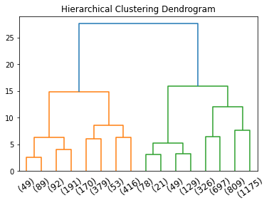

```python
from IPython.core.display import HTML
display(HTML("<style>pre { white-space: pre !important; }</style>"))


#LIBRARIES
import matplotlib.pyplot as plt
from collections import OrderedDict
import seaborn as sns

import pandas as pd

import simpy

from plotnine import *
import plotly.graph_objects as go
import numpy as np


# PYSPARK 
import pyspark # only run after findspark.init()
from pyspark.sql import SparkSession 
from pyspark.conf import SparkConf
from pyspark.sql.functions import *
from pyspark.mllib.stat import Statistics
from pyspark.sql.types import StringType, IntegerType, StructType, StructField

```


<style>pre { white-space: pre !important; }</style>


```python
spark = SparkSession \
    .builder \
    .appName("Python Spark SQL basic example") \
    .master("local[4]") \
    .config("spark.driver.maxResultSize", "8g") \
    .getOrCreate()
```


```python
df = spark.read.json('../data/cleaned_dataset')
```


```python
df.show()
```

    +------------+------------------+--------------------+---------------------+------------+-----------+------+--------------------+--------------------+----------------+---+--------+--------+----+----------------+------------+-----------+--------------------+---------------------+-------+--------------+-------+
    |acousticness|               age|avg_artist_followers|avg_artist_popularity|danceability|duration_ms|energy|              genres|            id_track|instrumentalness|key|liveness|loudness|mode|popularity_track|release_date|speechiness|sum_artist_followers|sum_artist_popularity|  tempo|time_signature|valence|
    +------------+------------------+--------------------+---------------------+------------+-----------+------+--------------------+--------------------+----------------+---+--------+--------+----+----------------+------------+-----------+--------------------+---------------------+-------+--------------+-------+
    |       0.658|41.821917808219176|              5403.5|                 40.0|       0.602|     156067| 0.552|[classic czech po...|00AeAaSNbe92PRrst...|             0.0|  0|  0.0972|  -6.667|   1|               3|  1980-01-01|      0.404|               10807|                   80|182.229|             3|   0.65|
    |       0.543|45.824657534246576|             19833.0|                 43.0|        0.77|     220133| 0.891|[afrobeat, afropo...|00DJt4PjkzeXhKKVD...|         7.96E-4|  1|  0.0684|  -7.306|   1|               9|  1976-01-01|      0.172|               19833|                   43|135.573|             4|  0.898|
    |      4.8E-5|25.673972602739727|            874600.0|                 68.0|       0.212|     250960| 0.986|[alternative meta...|00HgVIkZrAL8WjAN9...|           0.918|  0|   0.324|   -6.69|   0|              33|  1996-02-20|       0.14|              874600|                   68|140.917|             4|  0.231|
    |       0.144|31.813698630136987|             69129.0|                 42.0|       0.362|     457040| 0.453|[corrosion, dark ...|00Lx2f8NRiFKMGWa0...|           0.827| 11|   0.117| -17.744|   0|              35|  1990-01-01|     0.0398|               69129|                   42|118.853|             4|  0.257|
    |       0.957| 4.071232876712329|           1709414.0|                 68.0|       0.343|     282891| 0.225|[brazilian rock, ...|00fzPML4lrNag28OP...|         2.49E-4|  1|   0.661| -14.937|   0|              52|  2017-09-22|     0.0384|             1709414|                   68|144.533|             4|  0.101|
    |       0.119|13.802739726027397|           2092689.0|                 69.0|       0.893|     217000| 0.614|[brazilian rock, ...|00hUjt7XHLHwUB1L2...|         9.76E-4|  7|  0.0952|  -5.331|   1|              42|  2008-01-01|     0.0362|             2092689|                   69|120.021|             4|  0.958|
    |        0.96| 71.84109589041095|           1921672.0|                 63.0|       0.351|     545107|0.0944|[classical perfor...|00jrUA3PWiKaMpWJv...|          0.0339|  8|   0.083| -17.481|   1|               0|  1950-01-01|     0.0413|             3843344|                  126| 107.86|             4|  0.237|
    |       0.168|6.6657534246575345|              5109.0|                 37.0|       0.422|     256933| 0.912|                  []|00pEXGlxPsGuLm4Nq...|             0.0|  5|   0.129|  -3.806|   0|              49|  2015-02-18|     0.0799|                5109|                   37| 97.573|             4|  0.616|
    |       0.775|30.624657534246577|            800059.0|                 68.0|       0.627|     249133| 0.781|[arabesk, turkish...|00tC0YhP6IgvqziTK...|             0.0|  0|  0.0886|  -5.604|   0|              24|  1991-03-11|     0.0694|              800059|                   68|152.277|             4|  0.891|
    |       0.971|20.805479452054794|               930.0|                 32.0|       0.554|     189800| 0.123| [thai instrumental]|01HJPwlxD2TvR6CDL...|             0.0| 10|   0.142|   -14.1|   1|              20|  2001-01-01|     0.0438|                 930|                   32|103.292|             1|  0.549|
    |       0.945| 61.83561643835616|   99677.66666666667|   58.666666666666664|       0.189|     181733|0.0928|[american modern ...|01JxE2HpVI0RkCl9F...|           0.831|  1|   0.309| -14.585|   1|              10|  1960-01-01|     0.0359|              299033|                  176|   77.6|             4|  0.218|
    |      0.0904| 38.46849315068493|            147837.0|                 59.0|        0.46|     203000| 0.922|[classic swedish ...|01LyEKupJFOYJIoP7...|         7.42E-6|  9|   0.118|  -6.641|   1|              20|  1983-05-09|      0.105|              147837|                   59|116.004|             4|  0.473|
    |       0.868|16.019178082191782|             10781.0|                 51.0|       0.764|     213240| 0.455|          [mandopop]|01cO3ZfjGwlY7nMDD...|         2.67E-6|  3|  0.0962| -10.076|   1|              45|  2005-10-14|     0.0262|               10781|                   51| 105.07|             4|  0.478|
    |        0.81|30.813698630136987|             18355.0|                 46.0|       0.413|     282027| 0.317|[dutch pop, dutch...|01gXT3SsZhKTGZpZ4...|         2.17E-6|  8|  0.0884| -10.474|   1|              24|  1991-01-01|     0.0299|               18355|                   46|135.632|             4|  0.181|
    |        0.69| 25.60821917808219|            167088.0|                 57.0|       0.829|     161213| 0.384|[chamame, folclor...|01jHYLuEcT8wqm9b0...|             0.0|  4|  0.0981| -13.349|   0|              27|  1996-03-15|      0.218|              167088|                   57|103.259|             4|  0.918|
    |      0.0451|33.010958904109586|           1412267.0|                 75.0|       0.632|     237760| 0.917|[europop, new wav...|02LiDXI8KBS1k7pzQ...|         0.00122|  6|    0.21|  -4.683|   1|              33|  1988-10-21|     0.0294|             1412267|                   75|108.045|             4|  0.832|
    |       0.501| 5.989041095890411|            723458.5|                 68.5|       0.442|     244253|  0.76|[latin arena pop,...|02PFXdSFvYurNrZiD...|             0.0| 10|   0.715|  -3.186|   1|              45|  2015-10-23|     0.0588|             1446917|                  137|143.671|             4|  0.302|
    |      0.0424| 5.241095890410959|            173374.0|                 56.0|       0.582|     207673| 0.629|[dominican pop, r...|02QTUKz5AQFFfSNmo...|         3.44E-6|  4|   0.594|  -8.495|   0|              25|  2016-07-22|      0.433|              173374|                   56|113.155|             5|  0.482|
    |       0.136|0.5041095890410959|         2.7286822E7|                 95.0|       0.881|     200667| 0.696|[latin, reggaeton...|02Y5oRA5BuObhf9hT...|         4.06E-5| 11|  0.0927|  -3.838|   0|               0|  2021-04-16|     0.0797|            27286822|                   95| 97.002|             4|  0.781|
    |        0.44|2.5753424657534247|            100455.5|                 56.5|       0.686|     178264| 0.695|[argentine indie,...|02vK8PPOQPDcbxNe4...|         6.37E-6| 10|   0.314|  -6.087|   0|              56|  2019-03-22|      0.174|              200911|                  113| 140.25|             4|  0.541|
    +------------+------------------+--------------------+---------------------+------------+-----------+------+--------------------+--------------------+----------------+---+--------+--------+----+----------------+------------+-----------+--------------------+---------------------+-------+--------------+-------+
    only showing top 20 rows
    
    

# Explode on genres and group by genres with average


```python
df = df.withColumn('genre',explode(df.genres).alias("genre"))
```


```python
df.select('genre').show()
```

    +-------------------+
    |              genre|
    +-------------------+
    |  classic czech pop|
    |         czech folk|
    |         czech rock|
    |           afrobeat|
    |            afropop|
    |              world|
    |  alternative metal|
    |   gothenburg metal|
    |melodic death metal|
    |  melodic metalcore|
    |              metal|
    |           nu metal|
    |swedish death metal|
    |      swedish metal|
    |          corrosion|
    |          dark wave|
    |      ethereal wave|
    |         gothabilly|
    |        gothic rock|
    |     brazilian rock|
    +-------------------+
    only showing top 20 rows
    
    


```python
df.count()
```


    2032392


```python
numerical_columns = ['duration_ms','danceability','energy','key','age','loudness','speechiness','acousticness','instrumentalness','liveness','valence','tempo','time_signature']

```


```python
dfg = df.groupBy('genre').avg('duration_ms', 'danceability', 'energy', 'key', 'age', 'loudness', 'speechiness', 'acousticness', 'instrumentalness', 'liveness', 'valence', 'tempo', 'time_signature')
```


```python
for column in dfg.columns: 
    if column!='genre':
        dfg = dfg.withColumnRenamed(column,column[4:-1])
```


```python
dfg.printSchema()
```

    root
     |-- genre: string (nullable = true)
     |-- duration_ms: double (nullable = true)
     |-- danceability: double (nullable = true)
     |-- energy: double (nullable = true)
     |-- key: double (nullable = true)
     |-- age: double (nullable = true)
     |-- loudness: double (nullable = true)
     |-- speechiness: double (nullable = true)
     |-- acousticness: double (nullable = true)
     |-- instrumentalness: double (nullable = true)
     |-- liveness: double (nullable = true)
     |-- valence: double (nullable = true)
     |-- tempo: double (nullable = true)
     |-- time_signature: double (nullable = true)
    
    

 # Agglomerative Clustering


```python
%pip install sklearn
```

    Requirement already satisfied: sklearn in c:\users\carlo\anaconda3\envs\pyspark_env\lib\site-packages (0.0)
    Requirement already satisfied: scikit-learn in c:\users\carlo\anaconda3\envs\pyspark_env\lib\site-packages (from sklearn) (1.0)
    Requirement already satisfied: joblib>=0.11 in c:\users\carlo\anaconda3\envs\pyspark_env\lib\site-packages (from scikit-learn->sklearn) (1.1.0)
    Requirement already satisfied: numpy>=1.14.6 in c:\users\carlo\anaconda3\envs\pyspark_env\lib\site-packages (from scikit-learn->sklearn) (1.20.3)
    Requirement already satisfied: threadpoolctl>=2.0.0 in c:\users\carlo\anaconda3\envs\pyspark_env\lib\site-packages (from scikit-learn->sklearn) (3.0.0)
    Requirement already satisfied: scipy>=1.1.0 in c:\users\carlo\anaconda3\envs\pyspark_env\lib\site-packages (from scikit-learn->sklearn) (1.7.1)
    Note: you may need to restart the kernel to use updated packages.
    


```python

from sklearn.preprocessing import MinMaxScaler
from sklearn.preprocessing import StandardScaler
from sklearn.cluster import KMeans
from sklearn import preprocessing
from collections import defaultdict
from scipy.stats.stats import pearsonr

from scipy.stats import mode
from scipy.spatial.distance import pdist
from scipy.cluster.hierarchy import linkage, dendrogram
from sklearn.cluster import AgglomerativeClustering

```


```python
dfp = dfg.toPandas()
dfp
```


<div>
<style scoped>
    .dataframe tbody tr th:only-of-type {
        vertical-align: middle;
    }

    .dataframe tbody tr th {
        vertical-align: top;
    }

    .dataframe thead th {
        text-align: right;
    }
</style>
<table border="1" class="dataframe">
  <thead>
    <tr style="text-align: right;">
      <th></th>
      <th>genre</th>
      <th>duration_ms</th>
      <th>danceability</th>
      <th>energy</th>
      <th>key</th>
      <th>age</th>
      <th>loudness</th>
      <th>speechiness</th>
      <th>acousticness</th>
      <th>instrumentalness</th>
      <th>liveness</th>
      <th>valence</th>
      <th>tempo</th>
      <th>time_signature</th>
    </tr>
  </thead>
  <tbody>
    <tr>
      <th>0</th>
      <td>singer-songwriter</td>
      <td>234273.961846</td>
      <td>0.531303</td>
      <td>0.416796</td>
      <td>5.039608</td>
      <td>42.105547</td>
      <td>-12.790650</td>
      <td>0.049598</td>
      <td>0.525870</td>
      <td>0.042684</td>
      <td>0.212126</td>
      <td>0.508226</td>
      <td>117.987551</td>
      <td>3.861192</td>
    </tr>
    <tr>
      <th>1</th>
      <td>german metal</td>
      <td>270742.303409</td>
      <td>0.422507</td>
      <td>0.812688</td>
      <td>5.723864</td>
      <td>27.252684</td>
      <td>-7.405195</td>
      <td>0.072697</td>
      <td>0.044797</td>
      <td>0.146675</td>
      <td>0.266585</td>
      <td>0.373784</td>
      <td>125.949850</td>
      <td>3.946591</td>
    </tr>
    <tr>
      <th>2</th>
      <td>anime</td>
      <td>241981.625159</td>
      <td>0.472649</td>
      <td>0.706473</td>
      <td>4.959339</td>
      <td>16.039174</td>
      <td>-7.272574</td>
      <td>0.063093</td>
      <td>0.262410</td>
      <td>0.169810</td>
      <td>0.200269</td>
      <td>0.470637</td>
      <td>127.505146</td>
      <td>3.928844</td>
    </tr>
    <tr>
      <th>3</th>
      <td>french classical piano</td>
      <td>190929.922872</td>
      <td>0.377282</td>
      <td>0.087520</td>
      <td>5.348404</td>
      <td>61.992444</td>
      <td>-25.962604</td>
      <td>0.052109</td>
      <td>0.985242</td>
      <td>0.837186</td>
      <td>0.121261</td>
      <td>0.235529</td>
      <td>103.591138</td>
      <td>3.680851</td>
    </tr>
    <tr>
      <th>4</th>
      <td>poetry</td>
      <td>151074.614754</td>
      <td>0.673561</td>
      <td>0.127916</td>
      <td>6.881148</td>
      <td>67.896238</td>
      <td>-21.130205</td>
      <td>0.735375</td>
      <td>0.884918</td>
      <td>0.016971</td>
      <td>0.212004</td>
      <td>0.385096</td>
      <td>100.583541</td>
      <td>3.483607</td>
    </tr>
    <tr>
      <th>...</th>
      <td>...</td>
      <td>...</td>
      <td>...</td>
      <td>...</td>
      <td>...</td>
      <td>...</td>
      <td>...</td>
      <td>...</td>
      <td>...</td>
      <td>...</td>
      <td>...</td>
      <td>...</td>
      <td>...</td>
      <td>...</td>
    </tr>
    <tr>
      <th>4718</th>
      <td>british electroacoustic</td>
      <td>53560.000000</td>
      <td>0.161000</td>
      <td>0.491000</td>
      <td>4.000000</td>
      <td>53.830137</td>
      <td>-11.066000</td>
      <td>0.040600</td>
      <td>0.747000</td>
      <td>0.040400</td>
      <td>0.225000</td>
      <td>0.134000</td>
      <td>134.788000</td>
      <td>4.000000</td>
    </tr>
    <tr>
      <th>4719</th>
      <td>japanese chill rap</td>
      <td>221073.900000</td>
      <td>0.666900</td>
      <td>0.609600</td>
      <td>3.700000</td>
      <td>3.552603</td>
      <td>-7.179700</td>
      <td>0.198590</td>
      <td>0.433060</td>
      <td>0.000432</td>
      <td>0.136800</td>
      <td>0.482100</td>
      <td>122.367400</td>
      <td>4.000000</td>
    </tr>
    <tr>
      <th>4720</th>
      <td>aikatsu</td>
      <td>264933.000000</td>
      <td>0.592000</td>
      <td>0.988000</td>
      <td>4.000000</td>
      <td>9.800000</td>
      <td>0.239000</td>
      <td>0.152000</td>
      <td>0.185000</td>
      <td>0.000000</td>
      <td>0.060100</td>
      <td>0.531000</td>
      <td>135.063000</td>
      <td>4.000000</td>
    </tr>
    <tr>
      <th>4721</th>
      <td>bosnian indie</td>
      <td>226546.500000</td>
      <td>0.760250</td>
      <td>0.802750</td>
      <td>6.000000</td>
      <td>8.128082</td>
      <td>-4.840500</td>
      <td>0.046900</td>
      <td>0.173128</td>
      <td>0.000036</td>
      <td>0.167550</td>
      <td>0.949250</td>
      <td>145.002750</td>
      <td>4.000000</td>
    </tr>
    <tr>
      <th>4722</th>
      <td>"[""mens choir""</td>
      <td>196600.000000</td>
      <td>0.167000</td>
      <td>0.008210</td>
      <td>1.000000</td>
      <td>33.816438</td>
      <td>-42.137000</td>
      <td>0.038900</td>
      <td>0.981000</td>
      <td>0.001980</td>
      <td>0.116000</td>
      <td>0.144000</td>
      <td>127.411000</td>
      <td>5.000000</td>
    </tr>
  </tbody>
</table>
<p>4723 rows × 14 columns</p>
</div>


```python

scaler = preprocessing.MinMaxScaler()
dfs =pd.DataFrame(scaler.fit_transform(dfp[numerical_columns]),columns=numerical_columns,index=dfp['genre'])
dfs
```


<div>
<style scoped>
    .dataframe tbody tr th:only-of-type {
        vertical-align: middle;
    }

    .dataframe tbody tr th {
        vertical-align: top;
    }

    .dataframe thead th {
        text-align: right;
    }
</style>
<table border="1" class="dataframe">
  <thead>
    <tr style="text-align: right;">
      <th></th>
      <th>duration_ms</th>
      <th>danceability</th>
      <th>energy</th>
      <th>key</th>
      <th>age</th>
      <th>loudness</th>
      <th>speechiness</th>
      <th>acousticness</th>
      <th>instrumentalness</th>
      <th>liveness</th>
      <th>valence</th>
      <th>tempo</th>
      <th>time_signature</th>
    </tr>
    <tr>
      <th>genre</th>
      <th></th>
      <th></th>
      <th></th>
      <th></th>
      <th></th>
      <th></th>
      <th></th>
      <th></th>
      <th></th>
      <th></th>
      <th></th>
      <th></th>
      <th></th>
    </tr>
  </thead>
  <tbody>
    <tr>
      <th>singer-songwriter</th>
      <td>0.079558</td>
      <td>0.555175</td>
      <td>0.419276</td>
      <td>0.458146</td>
      <td>0.436991</td>
      <td>0.659076</td>
      <td>0.052044</td>
      <td>0.527981</td>
      <td>0.042726</td>
      <td>0.202497</td>
      <td>0.516621</td>
      <td>0.604869</td>
      <td>0.772238</td>
    </tr>
    <tr>
      <th>german metal</th>
      <td>0.093323</td>
      <td>0.441491</td>
      <td>0.817582</td>
      <td>0.520351</td>
      <td>0.280901</td>
      <td>0.780025</td>
      <td>0.076282</td>
      <td>0.044976</td>
      <td>0.146822</td>
      <td>0.260961</td>
      <td>0.379958</td>
      <td>0.645688</td>
      <td>0.789318</td>
    </tr>
    <tr>
      <th>anime</th>
      <td>0.082467</td>
      <td>0.493886</td>
      <td>0.710719</td>
      <td>0.450849</td>
      <td>0.163057</td>
      <td>0.783004</td>
      <td>0.066204</td>
      <td>0.263463</td>
      <td>0.169980</td>
      <td>0.189769</td>
      <td>0.478411</td>
      <td>0.653661</td>
      <td>0.785769</td>
    </tr>
    <tr>
      <th>french classical piano</th>
      <td>0.063198</td>
      <td>0.394234</td>
      <td>0.087992</td>
      <td>0.486219</td>
      <td>0.645983</td>
      <td>0.363253</td>
      <td>0.054678</td>
      <td>0.989199</td>
      <td>0.838024</td>
      <td>0.104951</td>
      <td>0.239420</td>
      <td>0.531065</td>
      <td>0.736170</td>
    </tr>
    <tr>
      <th>poetry</th>
      <td>0.048155</td>
      <td>0.703826</td>
      <td>0.128634</td>
      <td>0.625559</td>
      <td>0.708027</td>
      <td>0.471782</td>
      <td>0.771643</td>
      <td>0.888472</td>
      <td>0.016988</td>
      <td>0.202366</td>
      <td>0.391457</td>
      <td>0.515646</td>
      <td>0.696721</td>
    </tr>
    <tr>
      <th>...</th>
      <td>...</td>
      <td>...</td>
      <td>...</td>
      <td>...</td>
      <td>...</td>
      <td>...</td>
      <td>...</td>
      <td>...</td>
      <td>...</td>
      <td>...</td>
      <td>...</td>
      <td>...</td>
      <td>...</td>
    </tr>
    <tr>
      <th>british electroacoustic</th>
      <td>0.011349</td>
      <td>0.168234</td>
      <td>0.493932</td>
      <td>0.363636</td>
      <td>0.560205</td>
      <td>0.697809</td>
      <td>0.042602</td>
      <td>0.750000</td>
      <td>0.040440</td>
      <td>0.216318</td>
      <td>0.136213</td>
      <td>0.690997</td>
      <td>0.800000</td>
    </tr>
    <tr>
      <th>japanese chill rap</th>
      <td>0.074576</td>
      <td>0.696865</td>
      <td>0.613256</td>
      <td>0.336364</td>
      <td>0.031835</td>
      <td>0.785090</td>
      <td>0.208384</td>
      <td>0.434798</td>
      <td>0.000432</td>
      <td>0.121632</td>
      <td>0.490064</td>
      <td>0.627322</td>
      <td>0.800000</td>
    </tr>
    <tr>
      <th>aikatsu</th>
      <td>0.091130</td>
      <td>0.618600</td>
      <td>0.993963</td>
      <td>0.363636</td>
      <td>0.097490</td>
      <td>0.951703</td>
      <td>0.159496</td>
      <td>0.185742</td>
      <td>0.000000</td>
      <td>0.039291</td>
      <td>0.539771</td>
      <td>0.692407</td>
      <td>0.800000</td>
    </tr>
    <tr>
      <th>bosnian indie</th>
      <td>0.076641</td>
      <td>0.794410</td>
      <td>0.807584</td>
      <td>0.545455</td>
      <td>0.079919</td>
      <td>0.837625</td>
      <td>0.049213</td>
      <td>0.173822</td>
      <td>0.000036</td>
      <td>0.154643</td>
      <td>0.964930</td>
      <td>0.743364</td>
      <td>0.800000</td>
    </tr>
    <tr>
      <th>"[""mens choir""</th>
      <td>0.065338</td>
      <td>0.174504</td>
      <td>0.008198</td>
      <td>0.090909</td>
      <td>0.349880</td>
      <td>0.000000</td>
      <td>0.040818</td>
      <td>0.984940</td>
      <td>0.001982</td>
      <td>0.099302</td>
      <td>0.146379</td>
      <td>0.653179</td>
      <td>1.000000</td>
    </tr>
  </tbody>
</table>
<p>4723 rows × 13 columns</p>
</div>


```python
corrMatrix = dfs.corr()
for col in corrMatrix.columns:
    corrMatrix.loc[col,col] = 0

sns.heatmap(corrMatrix,cmap=sns.color_palette("vlag", as_cmap=True),xticklabels=corrMatrix.columns, yticklabels=corrMatrix.columns,annot =True)
```


    <AxesSubplot:>


    

    


```python
dfs.drop('energy',axis=1,inplace=True)
numerical_columns.remove('energy')
```


```python
import numpy as np

from matplotlib import pyplot as plt
from scipy.cluster.hierarchy import dendrogram

from sklearn.cluster import AgglomerativeClustering


def plot_dendrogram(model, **kwargs):
    # Create linkage matrix and then plot the dendrogram

    # create the counts of samples under each node
    counts = np.zeros(model.children_.shape[0])
    n_samples = len(model.labels_)
    for i, merge in enumerate(model.children_):
        current_count = 0
        for child_idx in merge:
            if child_idx < n_samples:
                current_count += 1  # leaf node
            else:
                current_count += counts[child_idx - n_samples]
        counts[i] = current_count

    linkage_matrix = np.column_stack([model.children_, model.distances_,
                                      counts]).astype(float)

    # Plot the corresponding dendrogram
    dendrogram(linkage_matrix, **kwargs)


```

### COMPLETE EUCLIDEAN


```python

clustering = AgglomerativeClustering(distance_threshold=0, n_clusters=None, linkage='complete',affinity='euclidean').fit(dfs[numerical_columns])

plt.title('Hierarchical Clustering Dendrogram')
# plot the top three levels of the dendrogram
plot_dendrogram(clustering, truncate_mode='level', p=3)
plt.xticks(rotation=35)
plt.xlabel("Number of points in node (or index of point if no parenthesis).")
plt.show()
```


    

    


```python

clustering = AgglomerativeClustering(n_clusters=11, linkage='complete',affinity='euclidean').fit(dfs[numerical_columns])
dfp['cluster'] = clustering.labels_
dfp['cluster'].value_counts()
```


    3     2698
    0      910
    8      387
    7      231
    4      193
    1      149
    5       97
    2       28
    10      27
    6        2
    9        1
    Name: cluster, dtype: int64


### WARD


```python

clustering = AgglomerativeClustering(distance_threshold=0, n_clusters=None, linkage='ward',affinity='euclidean').fit(dfs[numerical_columns])

```


```python

plt.title('Hierarchical Clustering Dendrogram')
# plot the top three levels of the dendrogram
plot_dendrogram(clustering, truncate_mode='level', p=3)
plt.xticks(rotation=35)
#plt.xlabel("Number of points in node (or index of point if no parenthesis).")
plt.show()
```


    

    


```python

clustering = AgglomerativeClustering(n_clusters=8, linkage='ward',affinity='euclidean').fit(dfs[numerical_columns])
dfp['cluster'] = clustering.labels_
dfp['cluster'].value_counts()
```


    3    1175
    6     809
    4     697
    2     549
    1     469
    0     421
    7     326
    5     277
    Name: cluster, dtype: int64


```python
for c in dfp.cluster.unique():
    print('__________\n',c,'\n_____________')
    print(dfp.loc[dfp.cluster==c,'genre'].value_counts(),end='\n\n')
```

    __________
     3 
    _____________
    singer-songwriter             1
    brega romantico               1
    dutch cabaret                 1
    nouvelle chanson francaise    1
    trondersk musikk              1
                                 ..
    cumbia uruguaya               1
    rock quebecois                1
    festigal                      1
    musica mocambicana            1
    aikatsu                       1
    Name: genre, Length: 1175, dtype: int64
    
    __________
     4 
    _____________
    german metal              1
    traditional ska           1
    christian rock            1
    groove metal              1
    norwegian punk rock       1
                             ..
    indie canario             1
    funk metal                1
    auckland indie            1
    okc indie                 1
    deep melodic metalcore    1
    Name: genre, Length: 697, dtype: int64
    
    __________
     7 
    _____________
    anime                 1
    rhode island indie    1
    indie emo             1
    brazilian bass        1
    dutch moombahton      1
                         ..
    uplifting trance      1
    retro metal           1
    indietronica          1
    filthstep             1
    deep eurodance        1
    Name: genre, Length: 326, dtype: int64
    
    __________
     0 
    _____________
    french classical piano    1
    classical cello           1
    spanish renaissance       1
    ukrainian classical       1
    argentine ambient         1
                             ..
    experimental ambient      1
    kantele                   1
    slack-key guitar          1
    chill guitar              1
    "[""mens choir""          1
    Name: genre, Length: 421, dtype: int64
    
    __________
     1 
    _____________
    poetry                   1
    michigan indie           1
    carnatic instrumental    1
    bluegrass gospel         1
    deep delta blues         1
                            ..
    cante flamenco           1
    hindustani classical     1
    musikkorps               1
    vintage rockabilly       1
    comedy                   1
    Name: genre, Length: 469, dtype: int64
    
    __________
     6 
    _____________
    hungarian hip hop           1
    musica eletronica gospel    1
    swedish trap                1
    australian trap             1
    dancehall colombiano        1
                               ..
    afrobeat fusion             1
    manele                      1
    hip hop tuga                1
    trap catala                 1
    bosnian indie               1
    Name: genre, Length: 809, dtype: int64
    
    __________
     5 
    _____________
    swedish black metal    1
    industrial techno      1
    bubble trance          1
    glitch hop             1
    deep deep house        1
                          ..
    halftime dnb           1
    jazz metal             1
    japanese chillhop      1
    tech house             1
    viking black metal     1
    Name: genre, Length: 277, dtype: int64
    
    __________
     2 
    _____________
    "[canadian country               1
    lithuanian indie                 1
    icelandic jazz                   1
    british industrial               1
    musique touareg                  1
                                    ..
    candombe                         1
    japanese experimental            1
    buffalo ny indie                 1
    norwegian folk                   1
    french contemporary classical    1
    Name: genre, Length: 549, dtype: int64
    
    

# Explore Results


```python
dfg
```


    DataFrame[genre: string, duration_ms: double, danceability: double, energy: double, key: double, age: double, loudness: double, speechiness: double, acousticness: double, instrumentalness: double, liveness: double, valence: double, tempo: double, time_signature: double]


```python
dfp
```


<div>
<style scoped>
    .dataframe tbody tr th:only-of-type {
        vertical-align: middle;
    }

    .dataframe tbody tr th {
        vertical-align: top;
    }

    .dataframe thead th {
        text-align: right;
    }
</style>
<table border="1" class="dataframe">
  <thead>
    <tr style="text-align: right;">
      <th></th>
      <th>genre</th>
      <th>duration_ms</th>
      <th>danceability</th>
      <th>energy</th>
      <th>key</th>
      <th>age</th>
      <th>loudness</th>
      <th>speechiness</th>
      <th>acousticness</th>
      <th>instrumentalness</th>
      <th>liveness</th>
      <th>valence</th>
      <th>tempo</th>
      <th>time_signature</th>
      <th>cluster</th>
    </tr>
  </thead>
  <tbody>
    <tr>
      <th>0</th>
      <td>singer-songwriter</td>
      <td>234273.961846</td>
      <td>0.531303</td>
      <td>0.416796</td>
      <td>5.039608</td>
      <td>42.105547</td>
      <td>-12.790650</td>
      <td>0.049598</td>
      <td>0.525870</td>
      <td>0.042684</td>
      <td>0.212126</td>
      <td>0.508226</td>
      <td>117.987551</td>
      <td>3.861192</td>
      <td>3</td>
    </tr>
    <tr>
      <th>1</th>
      <td>german metal</td>
      <td>270742.303409</td>
      <td>0.422507</td>
      <td>0.812688</td>
      <td>5.723864</td>
      <td>27.252684</td>
      <td>-7.405195</td>
      <td>0.072697</td>
      <td>0.044797</td>
      <td>0.146675</td>
      <td>0.266585</td>
      <td>0.373784</td>
      <td>125.949850</td>
      <td>3.946591</td>
      <td>4</td>
    </tr>
    <tr>
      <th>2</th>
      <td>anime</td>
      <td>241981.625159</td>
      <td>0.472649</td>
      <td>0.706473</td>
      <td>4.959339</td>
      <td>16.039174</td>
      <td>-7.272574</td>
      <td>0.063093</td>
      <td>0.262410</td>
      <td>0.169810</td>
      <td>0.200269</td>
      <td>0.470637</td>
      <td>127.505146</td>
      <td>3.928844</td>
      <td>7</td>
    </tr>
    <tr>
      <th>3</th>
      <td>french classical piano</td>
      <td>190929.922872</td>
      <td>0.377282</td>
      <td>0.087520</td>
      <td>5.348404</td>
      <td>61.992444</td>
      <td>-25.962604</td>
      <td>0.052109</td>
      <td>0.985242</td>
      <td>0.837186</td>
      <td>0.121261</td>
      <td>0.235529</td>
      <td>103.591138</td>
      <td>3.680851</td>
      <td>0</td>
    </tr>
    <tr>
      <th>4</th>
      <td>poetry</td>
      <td>151074.614754</td>
      <td>0.673561</td>
      <td>0.127916</td>
      <td>6.881148</td>
      <td>67.896238</td>
      <td>-21.130205</td>
      <td>0.735375</td>
      <td>0.884918</td>
      <td>0.016971</td>
      <td>0.212004</td>
      <td>0.385096</td>
      <td>100.583541</td>
      <td>3.483607</td>
      <td>1</td>
    </tr>
    <tr>
      <th>...</th>
      <td>...</td>
      <td>...</td>
      <td>...</td>
      <td>...</td>
      <td>...</td>
      <td>...</td>
      <td>...</td>
      <td>...</td>
      <td>...</td>
      <td>...</td>
      <td>...</td>
      <td>...</td>
      <td>...</td>
      <td>...</td>
      <td>...</td>
    </tr>
    <tr>
      <th>4718</th>
      <td>british electroacoustic</td>
      <td>53560.000000</td>
      <td>0.161000</td>
      <td>0.491000</td>
      <td>4.000000</td>
      <td>53.830137</td>
      <td>-11.066000</td>
      <td>0.040600</td>
      <td>0.747000</td>
      <td>0.040400</td>
      <td>0.225000</td>
      <td>0.134000</td>
      <td>134.788000</td>
      <td>4.000000</td>
      <td>0</td>
    </tr>
    <tr>
      <th>4719</th>
      <td>japanese chill rap</td>
      <td>221073.900000</td>
      <td>0.666900</td>
      <td>0.609600</td>
      <td>3.700000</td>
      <td>3.552603</td>
      <td>-7.179700</td>
      <td>0.198590</td>
      <td>0.433060</td>
      <td>0.000432</td>
      <td>0.136800</td>
      <td>0.482100</td>
      <td>122.367400</td>
      <td>4.000000</td>
      <td>6</td>
    </tr>
    <tr>
      <th>4720</th>
      <td>aikatsu</td>
      <td>264933.000000</td>
      <td>0.592000</td>
      <td>0.988000</td>
      <td>4.000000</td>
      <td>9.800000</td>
      <td>0.239000</td>
      <td>0.152000</td>
      <td>0.185000</td>
      <td>0.000000</td>
      <td>0.060100</td>
      <td>0.531000</td>
      <td>135.063000</td>
      <td>4.000000</td>
      <td>3</td>
    </tr>
    <tr>
      <th>4721</th>
      <td>bosnian indie</td>
      <td>226546.500000</td>
      <td>0.760250</td>
      <td>0.802750</td>
      <td>6.000000</td>
      <td>8.128082</td>
      <td>-4.840500</td>
      <td>0.046900</td>
      <td>0.173128</td>
      <td>0.000036</td>
      <td>0.167550</td>
      <td>0.949250</td>
      <td>145.002750</td>
      <td>4.000000</td>
      <td>6</td>
    </tr>
    <tr>
      <th>4722</th>
      <td>"[""mens choir""</td>
      <td>196600.000000</td>
      <td>0.167000</td>
      <td>0.008210</td>
      <td>1.000000</td>
      <td>33.816438</td>
      <td>-42.137000</td>
      <td>0.038900</td>
      <td>0.981000</td>
      <td>0.001980</td>
      <td>0.116000</td>
      <td>0.144000</td>
      <td>127.411000</td>
      <td>5.000000</td>
      <td>0</td>
    </tr>
  </tbody>
</table>
<p>4723 rows × 15 columns</p>
</div>


```python
dfp.to_csv('../data/wardEuclideanClustering.csv')
```


```python
dfp.columns
```


    Index(['genre', 'duration_ms', 'danceability', 'energy', 'key', 'age',
           'loudness', 'speechiness', 'acousticness', 'instrumentalness',
           'liveness', 'valence', 'tempo', 'time_signature', 'cluster'],
          dtype='object')


```python
labels=spark.read.option("header", "true").csv('../data/wardEuclideanClustering.csv')
labels.show()
```

    +---+--------------------+------------------+-------------------+-------------------+------------------+------------------+-------------------+-------------------+--------------------+--------------------+-------------------+-------------------+------------------+------------------+-------+
    |_c0|               genre|       duration_ms|       danceability|             energy|               key|               age|           loudness|        speechiness|        acousticness|    instrumentalness|           liveness|            valence|             tempo|    time_signature|cluster|
    +---+--------------------+------------------+-------------------+-------------------+------------------+------------------+-------------------+-------------------+--------------------+--------------------+-------------------+-------------------+------------------+------------------+-------+
    |  0|   singer-songwriter|234273.96184593023| 0.5313029069767441| 0.4167959883720931| 5.039607558139535|  42.1055471487734|-12.790649709302324|0.04959805595930232|  0.5258701518913517| 0.04268376563045057|0.21212612645348836| 0.5082259811046511|117.98755050872089|3.8611918604651163|      3|
    |  1|        german metal| 270742.3034090909|0.42250681818181823| 0.8126876136363638| 5.723863636363636|27.252683686176827| -7.405195454545455| 0.0726969318181818|0.044797129250000005| 0.14667523755681822| 0.2665854545454545|0.37378386363636357|125.94985000000004|3.9465909090909093|      4|
    |  2|               anime|  241981.625158831| 0.4726492376111818| 0.7064730622617534| 4.959339263024142| 16.03917425284155| -7.272573697585771| 0.0630928208386277|  0.2624100636404066| 0.16980954474587043|0.20026937738246509|  0.470637293519695|127.50514612452353| 3.928843710292249|      7|
    |  3|french classical ...|190929.92287234042| 0.3772816489361703| 0.0875203404255319| 5.348404255319149| 61.99244389390849| -25.96260372340426|0.05210851063829788|  0.9852420212765955|  0.8371861498670214|0.12126143617021276|0.23552925531914892|103.59113829787233|3.6808510638297873|      0|
    |  4|              poetry|151074.61475409835|  0.673561475409836|0.12791639344262293| 6.881147540983607| 67.89623849090502|-21.130204918032785| 0.7353754098360656|  0.8849180327868852|0.016971084713114752|0.21200409836065573| 0.3850959016393443|100.58354098360657|3.4836065573770494|      1|
    |  5|   hungarian hip hop|220718.72235872236| 0.7391965601965602| 0.6931737100737102| 5.941031941031941| 7.439534179260206| -6.363523341523341| 0.2188056511056511|  0.2838452948402948|0.005297855773955773|0.19579828009828013| 0.6003326781326781|109.04619164619166|  3.98034398034398|      6|
    |  6|     swedish hip hop|205369.56089193825| 0.7183499142367067| 0.6584476843910806| 5.518010291595197|  6.85365257642332| -7.342169811320754| 0.1991351629502573| 0.24050125728987992|0.002269163293310...|0.18149073756432246| 0.5979274442538591|114.47530531732419| 4.005145797598628|      6|
    |  7|vlaamse kinderliedje|220689.91544117648| 0.7076433823529411| 0.7297680147058823| 4.580882352941177|21.046927880741336| -8.013669117647058|0.07035441176470589|  0.2507016106617647|0.013931875808823527|0.21686948529411762| 0.7451761029411763|126.85789705882355| 3.911764705882353|      3|
    |  8|  australian hip hop|213369.70984455958| 0.7110051813471502| 0.7217357512953368| 5.419689119170984| 7.982184683086095|-6.1524404145077725|0.14964507772020727| 0.21039393782383414|0.006556340466321242|0.19620000000000004| 0.5949999999999999|116.01502072538862|3.9792746113989637|      6|
    |  9|     classic bhangra|391619.56842105265| 0.6479789473684211| 0.7549715789473687|               5.8|22.960288392213414| -8.394884210526316|0.09356105263157893|  0.2578906105263158|0.030146234631578946| 0.2759094736842105| 0.7892842105263158|118.37023157894737|3.9789473684210526|      6|
    | 10|           chunchaca| 209022.6403508772| 0.7204473684210526| 0.6218333333333333|4.7105263157894735| 26.88877673636145|   -9.1854649122807|0.06352017543859648|  0.2953157894736842| 0.08360240263157895|0.16322280701754385| 0.8399824561403509|118.09824561403508| 3.991228070175439|      3|
    | 11| swedish black metal|304179.48780487804|0.28468536585365856| 0.8526829268292682| 6.146341463414634|31.490878717006346|  -8.33760975609756|0.08215609756097561| 0.04681875780487805|  0.5726672634146343|0.24529024390243903|0.18639756097560975|124.20848780487806|               4.0|      5|
    | 12|"""[canadian coun...|          250129.0| 0.4463333333333333|0.31766666666666665| 4.833333333333333|22.653881278538815|-11.396499999999998|            0.03465|             0.54055|3.822833333333333...|0.15081666666666668|            0.24915|124.77066666666667|3.8333333333333335|      2|
    | 13|            basshall|182056.01694915254| 0.7526610169491528| 0.6815847457627119| 5.432203389830509|4.0693986533550035|-5.7809152542372875|0.16697711864406778| 0.16484206779661018| 0.00879814838983051| 0.1665720338983051| 0.5942457627118645|116.20691525423733| 4.016949152542373|      6|
    | 14|south african cou...|214330.07954545456| 0.6258068181818182| 0.6181818181818183|             5.375|20.052334993773353| -8.958943181818183|0.04653522727272727| 0.31590832954545456|0.002588362386363...|0.17485795454545455| 0.6334886363636364|125.22902272727273|3.8636363636363638|      3|
    | 15|    japanese pop rap| 209387.6923076923|  0.726974358974359| 0.6552307692307692| 5.794871794871795| 2.552581664910432|-6.0452564102564095|0.09466410256410256| 0.36401051282051283|0.005360793076923077|0.11941794871794872| 0.6968205128205128|119.16197435897436|               4.0|      6|
    | 16|       roots worship|266953.11392405065| 0.4509620253164556| 0.4136822784810127|4.6455696202531644|16.938685625108374|-10.744987341772152|              0.033|  0.4823650632911392|0.007914906962025315| 0.2030354430379747| 0.3376151898734177| 111.4619493670886|3.7468354430379747|      2|
    | 17| persian traditional|      346456.21875|        0.433496875|             0.3343|           5.65625| 37.35539383561644|-12.244093750000001|        0.047428125|         0.787596875|        0.1993489775|        0.165003125|        0.371896875|105.92559374999998|           3.59375|      0|
    | 18|      croatian indie|234518.34782608695| 0.6041304347826089| 0.7529565217391305| 5.391304347826087| 36.68719475878499| -8.135913043478261|0.07259999999999998| 0.12333217391304348|0.011111302608695653|0.17163043478260867| 0.7255652173913043|126.95952173913041| 3.869565217391304|      6|
    | 19|    tamaulipas indie|230023.66666666666| 0.5213333333333333| 0.7477777777777778|               7.0|15.024961948249619| -5.265333333333333|0.03712222222222222| 0.09111711111111112|0.001349098888888...|0.22899999999999998| 0.6454444444444446|125.21100000000001| 3.888888888888889|      6|
    +---+--------------------+------------------+-------------------+-------------------+------------------+------------------+-------------------+-------------------+--------------------+--------------------+-------------------+-------------------+------------------+------------------+-------+
    only showing top 20 rows
    
    


```python
labels = labels.select('cluster','genre').groupBy('cluster').agg(collect_set('genre').alias("genres"))
labels.show(truncate=True)

```

    +-------+--------------------+
    |cluster|              genres|
    +-------+--------------------+
    |      7|[olympia wa indie...|
    |      3|[hurdy-gurdy, nep...|
    |      0|[danish classical...|
    |      5|[swedish black me...|
    |      6|[thai hip hop, tr...|
    |      1|[oratory, electri...|
    |      4|[russian dnb, mel...|
    |      2|[hollywood, japan...|
    +-------+--------------------+
    
    


```python
from pyspark.sql.functions import col, concat_ws
labels = labels.withColumn('genres',
   concat_ws(" ",col('genres')))
```


```python
labels.show()
```

    +-------+--------------------+
    |cluster|              genres|
    +-------+--------------------+
    |      7|olympia wa indie ...|
    |      3|hurdy-gurdy nepal...|
    |      0|danish classical ...|
    |      5|swedish black met...|
    |      6|thai hip hop trap...|
    |      1|oratory electric ...|
    |      4|russian dnb melod...|
    |      2|hollywood japanes...|
    +-------+--------------------+
    
    


```python
labels = labels.withColumn('genres',regexp_replace(col("genres"), r"(^\[)|(\]$)|(')", " "))
```


```python
from collections import Counter
```


```python
labelsp = labels.toPandas()
```


```python
labelsp
```


<div>
<style scoped>
    .dataframe tbody tr th:only-of-type {
        vertical-align: middle;
    }

    .dataframe tbody tr th {
        vertical-align: top;
    }

    .dataframe thead th {
        text-align: right;
    }
</style>
<table border="1" class="dataframe">
  <thead>
    <tr style="text-align: right;">
      <th></th>
      <th>cluster</th>
      <th>genres</th>
    </tr>
  </thead>
  <tbody>
    <tr>
      <th>0</th>
      <td>7</td>
      <td>olympia wa indie latin surf rock """[australia...</td>
    </tr>
    <tr>
      <th>1</th>
      <td>3</td>
      <td>hurdy-gurdy nepali pop dance rock afghan pop s...</td>
    </tr>
    <tr>
      <th>2</th>
      <td>0</td>
      <td>danish classical new zealand classical british...</td>
    </tr>
    <tr>
      <th>3</th>
      <td>5</td>
      <td>swedish black metal scottish techno nitzhonot ...</td>
    </tr>
    <tr>
      <th>4</th>
      <td>6</td>
      <td>thai hip hop trap carioca southampton indie at...</td>
    </tr>
    <tr>
      <th>5</th>
      <td>1</td>
      <td>oratory electric bass yoik organic ambient ind...</td>
    </tr>
    <tr>
      <th>6</th>
      <td>4</td>
      <td>russian dnb melodic power metal candy pop uk a...</td>
    </tr>
    <tr>
      <th>7</th>
      <td>2</td>
      <td>hollywood japanese disney disney norsk bhajan ...</td>
    </tr>
  </tbody>
</table>
</div>


```python
i for in labelsp.index
```


    RangeIndex(start=0, stop=8, step=1)


```python
for i in labelsp.index:
    
    s = labelsp.loc[i,'genres']
    count = Counter(s.split(' '))
    print(sorted([(i,c) for i,c in count.items()],key=lambda x:x[1],reverse=True)[:10])
    print('\n\n')
```

    [('indie', 48), ('house', 44), ('rock', 17), ('electronic', 17), ('deep', 14), ('pop', 12), ('trance', 11), ('japanese', 9), ('metal', 9), ('electro', 8)]
    
    
    
    [('pop', 197), ('rock', 142), ('indie', 127), ('classic', 47), ('folk', 40), ('musica', 31), ('soul', 24), ('country', 23), ('alternative', 20), ('blues', 19)]
    
    
    
    [('classical', 107), ('piano', 38), ('contemporary', 24), ('choir', 22), ('jazz', 19), ('italian', 16), ('orchestra', 14), ('soundtrack', 14), ('baroque', 14), ('performance', 13)]
    
    
    
    [('metal', 39), ('techno', 35), ('house', 23), ('black', 21), ('electronic', 20), ('deep', 15), ('trance', 14), ('post-rock', 11), ('minimal', 9), ('experimental', 9)]
    
    
    
    [('hip', 137), ('hop', 136), ('rap', 121), ('indie', 67), ('pop', 64), ('trap', 51), ('reggae', 27), ('rock', 20), ('deep', 20), ('funk', 19)]
    
    
    
    [('jazz', 43), ('folk', 34), ('pop', 25), ('traditional', 22), ('blues', 20), ('vintage', 20), ('musica', 10), ('comedy', 9), ('country', 9), ('classic', 9)]
    
    
    
    [('metal', 175), ('rock', 86), ('punk', 84), ('indie', 83), ('hardcore', 29), ('pop', 27), ('alternative', 18), ('power', 17), ('death', 17), ('german', 17)]
    
    
    
    [('folk', 55), ('indie', 50), ('pop', 43), ('jazz', 38), ('musica', 28), ('rock', 19), ('classic', 15), ('singer-songwriter', 13), ('experimental', 12), ('japanese', 10)]
    
    
    
    


```python
sorted([(i,c) for i,c in count.items()],key=lambda x:x[1],reverse=True)[:10]
```


    [('indie', 48),
     ('house', 44),
     ('rock', 17),
     ('electronic', 17),
     ('deep', 14),
     ('pop', 12),
     ('trance', 11),
     ('japanese', 9),
     ('metal', 9),
     ('electro', 8)]


```python
count.items()
```


    dict_items([('olympia', 1), ('wa', 1), ('indie', 48), ('latin', 1), ('surf', 1), ('rock', 17), ('"""[australian', 1), ('alternative', 5), ('rock"', 1), ('electro', 8), ('swing', 1), ('bay', 1), ('area', 1), ('hardcore', 3), ('techno', 7), ('fidget', 1), ('house', 44), ('j-core', 1), ('punk', 5), ('japanese', 9), ('dream', 1), ('pop', 12), ('future', 4), ('jazz', 5), ('fusion', 1), ('dutch', 6), ('moombahton', 1), ('korean', 1), ('dark', 2), ('trance', 11), ('british', 1), ('slap', 1), ('uk', 3), ('tech', 4), ('funky', 3), ('breaks', 1), ('dnb', 3), ('trip', 1), ('hop', 1), ('electro-industrial', 1), ('"""[disco', 1), ('house"', 3), ('indian', 3), ('lithuanian', 2), ('edm', 7), ('bulgarian', 1), ('electronic', 17), ('"""""jackin', 2), ('house""""]"""', 2), ('retro', 1), ('metal', 9), ('christian', 2), ('thrash', 1), ('darkstep', 1), ('shred', 1), ('breakcore', 1), ('tribal', 1), ('gothic', 2), ('post-punk', 4), ('gothabilly', 1), ('hungarian', 1), ('western', 1), ('mass', 1), ('progressive', 4), ('big', 2), ('beat', 3), ('jungle', 1), ('balearic', 1), ('deep', 14), ('eurodance', 1), ('no', 1), ('wave', 4), ('persian', 1), ('rochester', 1), ('mn', 1), ('swedish', 4), ('tijuana', 1), ('beats', 1), ('neo-psychedelic', 1), ('tucson', 1), ('tropical', 2), ('german', 5), ('street', 1), ('french', 5), ('indietronica', 2), ('russian', 4), ('norwegian', 1), ('space', 1), ('disco', 4), ('australian', 3), ('dance', 4), ('euro', 1), ('psychedelic', 5), ('doom', 1), ('aggrotech', 1), ('unblack', 1), ('classic', 2), ('dubstep', 4), ('nu', 3), ('dub', 5), ('gbvfi', 1), ('reggae', 1), ('bmore', 1), ('math', 2), ('anime', 1), ('nantes', 1), ('groove', 3), ('room', 2), ('guitar', 1), ('rhode', 1), ('island', 1), ('canadian', 3), ('czech', 1), ('santa', 1), ('fe', 1), ('new', 4), ('delhi', 1), ('"""[deep', 2), ('gaming', 2), ('boston', 2), ('shoegaze', 3), ('emo', 2), ('nyahbinghi', 1), ('"""[""""jackin', 1), ('electropop', 3), ('brazilian', 3), ('bass', 3), ('phonk', 1), ('louisville', 1), ('filthstep', 1), ('drumfunk', 1), ('chillwave', 1), ('power', 1), ('blues-rock', 1), ('slavic', 1), ('broken', 1), ('swiss', 2), ('edmonton', 1), ('arab', 2), ('trap', 3), ('greek', 3), ('sunset', 1), ('lounge', 4), ('bath', 1), ('downtempo', 1), ('derby', 1), ('danish', 3), ('electrofox', 1), ('footwork', 1), ('melbourne', 2), ('bounce', 2), ('finnish', 3), ('chicago', 1), ('chamber', 1), ('psych', 4), ('bboy', 1), ('breakbeat', 1), ('atmospheric', 1), ('vocal', 2), ('experimental', 4), ('italian', 3), ('electronica', 3), ('ninja', 1), ('cologne', 1), ('noise', 3), ('stoner', 1), ('traprun', 1), ('soul', 1), ('austrian', 1), ('nz', 1), ('jazztronica', 2), ('spanish', 3), ('guaracha', 1), ('corrosion', 1), ('house"""""', 1), ('funk', 1), ('nintendocore', 1), ('alternativo', 1), ('espanol', 1), ('belgian', 3), ('lund', 1), ('atlanta', 1), ('glitch', 1), ('irish', 1), ('garage', 5), ('ambeat', 1), ('progressif', 1), ('francais', 2), ('platense', 1), ('digital', 1), ('chilean', 1), ('ebm', 1), ('minimal', 2), ('lowercase', 1), ('palm', 1), ('desert', 1), ('scene', 1), ('field', 1), ('recording', 1), ('rave', 1), ('electro-pop', 1), ('munich', 1), ('uplifting', 3), ('idaho', 1), ('gaze', 2), ('neue', 1), ('deutsche', 1), ('todeskunst', 1), ('tulsa', 1), ('amapiano', 1), ('complextro', 1), ('ska', 1), ('grimewave', 1), ('chilena', 1), ('fuzzpop', 1), ('panamanian', 1), ('detroit', 1), ('montreal', 1), ('vogue', 1), ('indonesian', 1), ('york', 1), ('oxford', 1), ('ruta', 1), ('destroy', 2), ('polish', 1), ('folk', 2), ('beach', 1), ('soulful', 1), ('oc', 1), ('grave', 1), ('icelandic', 1), ('therapy', 1), ('trival', 1), ('chill', 1), ('italogaze', 1), ('dayton', 1), ('leipzig', 1), ('psybass', 1), ('synthpop', 1), ('brooklyn', 1), ('brostep', 1), ('wellington', 1), ('kenyan', 1), ('portland', 1), ('ambient', 1), ('idm', 1), ('international', 1), ('prog', 1), ('dunedin', 1), ('sound', 1), ('solipsynthm', 1), ('gqom', 1), ('shimmer', 1), ('hard', 2), ('neo-synthpop', 1), ('"""[chicago', 1), ('punk"', 1), ('scottish', 1), ('malaysian', 1), ('fake', 1), ('aussietronica', 1), ('neotango', 1), ('jumpstyle', 1), ('hamburg', 1), ('slovak', 1), ('jersey', 1), ('neurofunk', 1), ('industrial', 1), ('sevilla', 1), ('acid', 1), ('siciliana', 1), ('deconstructed', 1), ('club', 1), ('orebro', 1), ('welsh', 1), ('afro', 1), ('vaporwave', 1), ('south', 3), ('african', 3), ('instrumental', 1), ('tekk', 1), ('filter', 1), ('post-rock', 1), ('touch', 1), ('didgeridoo', 1), ('cedm', 1), ('r&b', 1), ('gothenburg', 1), ('electroclash', 1)])


