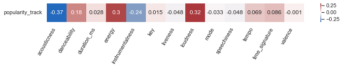
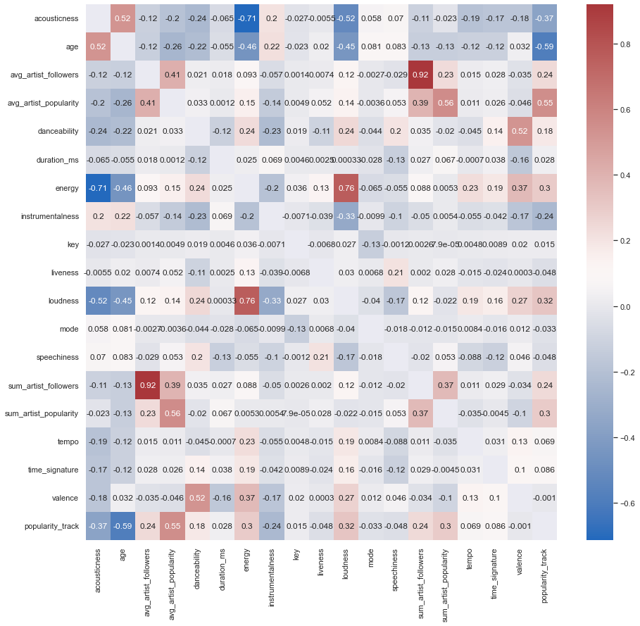
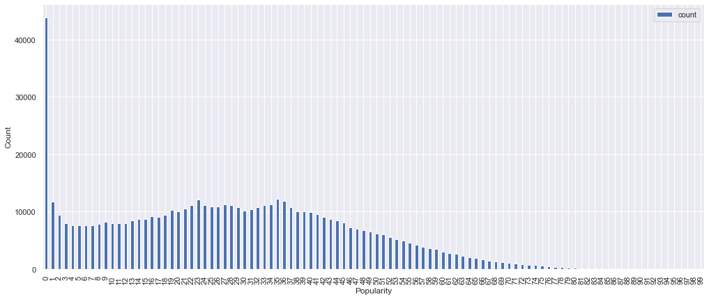
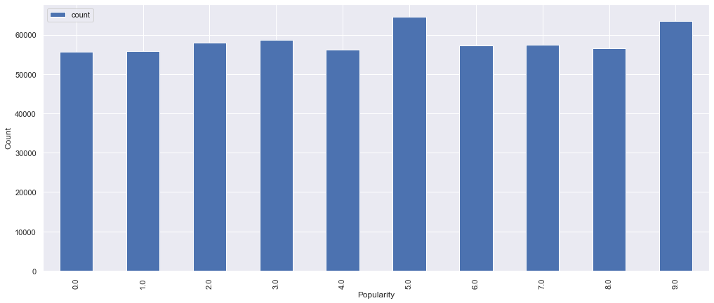

```python
from IPython.core.display import HTML
display(HTML("<style>pre { white-space: pre !important; }</style>"))
```


<style>pre { white-space: pre !important; }</style>


# Initialize Sparks Contest


```python
import matplotlib.pyplot as plt
from collections import OrderedDict
import seaborn as sns

import pandas as pd

import plotly.graph_objects as go
import numpy as np
```


```python
import pyspark # only run after findspark.init()
from pyspark.sql import SparkSession 
from pyspark.conf import SparkConf
from pyspark.sql.functions import *
from pyspark.mllib.stat import Statistics
from pyspark.sql.types import StringType, IntegerType, StructType, StructField
```


```python
spark = SparkSession \
    .builder \
    .appName("regression") \
    .master("local[4]") \
    .config("spark.driver.maxResultSize", "8g") \
    .config("spark.network.timeout","3600")\
    .config("spark.executor.heartbeatInterval","3000s")\
    .getOrCreate()
```

# Read Dataset


```python
spark
```


    <div>
        <p><b>SparkSession - in-memory</b></p>

<div>
    <p><b>SparkContext</b></p>

    <p><a href="http://DESKTOP-FIMTLSS.station:4040">Spark UI</a></p>

    <dl>
      <dt>Version</dt>
        <dd><code>v2.4.0</code></dd>
      <dt>Master</dt>
        <dd><code>local[4]</code></dd>
      <dt>AppName</dt>
        <dd><code>regression</code></dd>
    </dl>
</div>

    </div>


```python
df = spark.read.json('../data/cleaned_dataset')
df.show(3,truncate=False,vertical =True)
df.count()
```

    -RECORD 0---------------------------------------------------------------------------------------------------------------------------------------------------
     acousticness          | 0.658                                                                                                                              
     age                   | 41.821917808219176                                                                                                                 
     avg_artist_followers  | 5403.5                                                                                                                             
     avg_artist_popularity | 40.0                                                                                                                               
     danceability          | 0.602                                                                                                                              
     duration_ms           | 156067                                                                                                                             
     energy                | 0.552                                                                                                                              
     genres                | [classic czech pop, czech folk, czech rock]                                                                                        
     id_track              | 00AeAaSNbe92PRrstQskvH                                                                                                             
     instrumentalness      | 0.0                                                                                                                                
     key                   | 0                                                                                                                                  
     liveness              | 0.0972                                                                                                                             
     loudness              | -6.667                                                                                                                             
     mode                  | 1                                                                                                                                  
     popularity_track      | 3                                                                                                                                  
     release_date          | 1980-01-01                                                                                                                         
     speechiness           | 0.404                                                                                                                              
     sum_artist_followers  | 10807                                                                                                                              
     sum_artist_popularity | 80                                                                                                                                 
     tempo                 | 182.229                                                                                                                            
     time_signature        | 3                                                                                                                                  
     valence               | 0.65                                                                                                                               
    -RECORD 1---------------------------------------------------------------------------------------------------------------------------------------------------
     acousticness          | 0.543                                                                                                                              
     age                   | 45.824657534246576                                                                                                                 
     avg_artist_followers  | 19833.0                                                                                                                            
     avg_artist_popularity | 43.0                                                                                                                               
     danceability          | 0.77                                                                                                                               
     duration_ms           | 220133                                                                                                                             
     energy                | 0.891                                                                                                                              
     genres                | [afrobeat, afropop, world]                                                                                                         
     id_track              | 00DJt4PjkzeXhKKVDekw2n                                                                                                             
     instrumentalness      | 7.96E-4                                                                                                                            
     key                   | 1                                                                                                                                  
     liveness              | 0.0684                                                                                                                             
     loudness              | -7.306                                                                                                                             
     mode                  | 1                                                                                                                                  
     popularity_track      | 9                                                                                                                                  
     release_date          | 1976-01-01                                                                                                                         
     speechiness           | 0.172                                                                                                                              
     sum_artist_followers  | 19833                                                                                                                              
     sum_artist_popularity | 43                                                                                                                                 
     tempo                 | 135.573                                                                                                                            
     time_signature        | 4                                                                                                                                  
     valence               | 0.898                                                                                                                              
    -RECORD 2---------------------------------------------------------------------------------------------------------------------------------------------------
     acousticness          | 4.8E-5                                                                                                                             
     age                   | 25.673972602739727                                                                                                                 
     avg_artist_followers  | 874600.0                                                                                                                           
     avg_artist_popularity | 68.0                                                                                                                               
     danceability          | 0.212                                                                                                                              
     duration_ms           | 250960                                                                                                                             
     energy                | 0.986                                                                                                                              
     genres                | [alternative metal, gothenburg metal, melodic death metal, melodic metalcore, metal, nu metal, swedish death metal, swedish metal] 
     id_track              | 00HgVIkZrAL8WjAN9Et6WW                                                                                                             
     instrumentalness      | 0.918                                                                                                                              
     key                   | 0                                                                                                                                  
     liveness              | 0.324                                                                                                                              
     loudness              | -6.69                                                                                                                              
     mode                  | 0                                                                                                                                  
     popularity_track      | 33                                                                                                                                 
     release_date          | 1996-02-20                                                                                                                         
     speechiness           | 0.14                                                                                                                               
     sum_artist_followers  | 874600                                                                                                                             
     sum_artist_popularity | 68                                                                                                                                 
     tempo                 | 140.917                                                                                                                            
     time_signature        | 4                                                                                                                                  
     valence               | 0.231                                                                                                                              
    only showing top 3 rows
    
    


    583363


```python
df.printSchema()
```

    root
     |-- acousticness: double (nullable = true)
     |-- age: double (nullable = true)
     |-- avg_artist_followers: double (nullable = true)
     |-- avg_artist_popularity: double (nullable = true)
     |-- danceability: double (nullable = true)
     |-- duration_ms: long (nullable = true)
     |-- energy: double (nullable = true)
     |-- genres: array (nullable = true)
     |    |-- element: string (containsNull = true)
     |-- id_track: string (nullable = true)
     |-- instrumentalness: double (nullable = true)
     |-- key: long (nullable = true)
     |-- liveness: double (nullable = true)
     |-- loudness: double (nullable = true)
     |-- mode: long (nullable = true)
     |-- popularity_track: long (nullable = true)
     |-- release_date: string (nullable = true)
     |-- speechiness: double (nullable = true)
     |-- sum_artist_followers: long (nullable = true)
     |-- sum_artist_popularity: long (nullable = true)
     |-- tempo: double (nullable = true)
     |-- time_signature: long (nullable = true)
     |-- valence: double (nullable = true)
    
    

# Data Preparation 


```python

df = df.na.drop(how='any')
df.count()
```


    583363


```python
df.columns
```


    ['acousticness',
     'age',
     'avg_artist_followers',
     'avg_artist_popularity',
     'danceability',
     'duration_ms',
     'energy',
     'genres',
     'id_track',
     'instrumentalness',
     'key',
     'liveness',
     'loudness',
     'mode',
     'popularity_track',
     'release_date',
     'speechiness',
     'sum_artist_followers',
     'sum_artist_popularity',
     'tempo',
     'time_signature',
     'valence']


```python
all_numerical_columns = ['acousticness', 'age', 'avg_artist_followers', 'avg_artist_popularity', 'danceability', 'duration_ms',
    'energy', 'instrumentalness', 'key', 'liveness', 'loudness', 'mode',  'speechiness',
    'sum_artist_followers', 'sum_artist_popularity', 'tempo', 'time_signature', 'valence','popularity_track']

technical_columns = ['acousticness', 'danceability', 'duration_ms', 'energy', 'instrumentalness', 'key', 'liveness', 'loudness', 'mode',  'speechiness', 'tempo', 'time_signature', 'valence','popularity_track']
```


```python
from pyspark.ml.feature import VectorAssembler

assembler = VectorAssembler(
    inputCols=technical_columns,
    outputCol="features")

df = assembler.transform(df)
df.select('features').show()
```

    +--------------------+
    |            features|
    +--------------------+
    |[0.658,0.602,1560...|
    |[0.543,0.77,22013...|
    |[4.8E-5,0.212,250...|
    |[0.144,0.362,4570...|
    |[0.957,0.343,2828...|
    |[0.119,0.893,2170...|
    |[0.96,0.351,54510...|
    |[0.168,0.422,2569...|
    |[0.775,0.627,2491...|
    |[0.971,0.554,1898...|
    |[0.945,0.189,1817...|
    |[0.0904,0.46,2030...|
    |[0.868,0.764,2132...|
    |[0.81,0.413,28202...|
    |[0.69,0.829,16121...|
    |[0.0451,0.632,237...|
    |[0.501,0.442,2442...|
    |[0.0424,0.582,207...|
    |[0.136,0.881,2006...|
    |[0.44,0.686,17826...|
    +--------------------+
    only showing top 20 rows
    
    

### CORRELATION


```python
from pyspark.ml.linalg import DenseMatrix, Vectors
from pyspark.ml.stat import Correlation
corrMat = Correlation.corr(df, "features").head()[0]

corr_mat = pd.DataFrame(corrMat.toArray(),index=technical_columns,columns=technical_columns)
for i in corr_mat: corr_mat.loc[i,i] = np.nan
sns.set(rc={'figure.figsize':(11.7,8.27)})
sns.heatmap(corr_mat,cmap=sns.color_palette("vlag", as_cmap=True),xticklabels=technical_columns, yticklabels=technical_columns,annot=True)
```


    <AxesSubplot:>


    

    


```python
technical_columns.remove('popularity_track')
sns.set(rc={'figure.figsize':(11.7,0.7)})
heatmap = sns.heatmap(corr_mat.loc[['popularity_track'],technical_columns],cmap=sns.color_palette("vlag", as_cmap=True),xticklabels=technical_columns, yticklabels=['popularity'],annot=True)
heatmap.set_xticklabels(technical_columns, rotation=60,horizontalalignment='right')
heatmap.set_yticklabels(['popularity_track'], rotation=0) 
heatmap
```


    <AxesSubplot:>


    

    


```python

from pyspark.ml.feature import VectorAssembler

assembler = VectorAssembler(
    inputCols=all_numerical_columns,
    outputCol="allFeatures")

df = assembler.transform(df)
df.select('allFeatures').show()
```

    +--------------------+
    |         allFeatures|
    +--------------------+
    |[0.658,41.8219178...|
    |[0.543,45.8246575...|
    |[4.8E-5,25.673972...|
    |[0.144,31.8136986...|
    |[0.957,4.07123287...|
    |[0.119,13.8027397...|
    |[0.96,71.84109589...|
    |[0.168,6.66575342...|
    |[0.775,30.6246575...|
    |[0.971,20.8054794...|
    |[0.945,61.8356164...|
    |[0.0904,38.468493...|
    |[0.868,16.0191780...|
    |[0.81,30.81369863...|
    |[0.69,25.60821917...|
    |[0.0451,33.010958...|
    |[0.501,5.98904109...|
    |[0.0424,5.2410958...|
    |[0.136,0.50410958...|
    |[0.44,2.575342465...|
    +--------------------+
    only showing top 20 rows
    
    


```python
from pyspark.ml.linalg import DenseMatrix, Vectors
from pyspark.ml.stat import Correlation
corrMat = Correlation.corr(df, "allFeatures").head()[0]

corr_mat = pd.DataFrame(corrMat.toArray(),index=all_numerical_columns,columns=all_numerical_columns)
for i in corr_mat: corr_mat.loc[i,i] = np.nan
sns.set(rc={'figure.figsize':(15,14)})
sns.heatmap(corr_mat,cmap=sns.color_palette("vlag", as_cmap=True),xticklabels=all_numerical_columns, yticklabels=all_numerical_columns,annot=True)
```


    <AxesSubplot:>


    

    


```python
all_numerical_columns.remove('popularity_track')
sns.set(rc={'figure.figsize':(12,0.7)})
heatmap = sns.heatmap(corr_mat.loc[['popularity_track'],all_numerical_columns],cmap=sns.color_palette("vlag", as_cmap=True),xticklabels=all_numerical_columns, yticklabels=['popularity'],annot=True)
heatmap.set_xticklabels(all_numerical_columns, rotation=60,horizontalalignment='right')
heatmap.set_yticklabels(['popularity_track'], rotation=0) 
heatmap
```


    <AxesSubplot:>


    

    


### POPULARITI DISTRIBUTION


```python
import pyspark.sql.functions as F

def value_counts(spark_df, colm, order=1, n=10):

    if order==1 :
        return pd.DataFrame(spark_df.select(colm).groupBy(colm).count().orderBy(F.desc_nulls_first("count")).head(n),columns=["value","count"]) 
    if order==2 :
        return pd.DataFrame(spark_df.select(colm).groupBy(colm).count().orderBy(F.asc(colm)).head(n),columns=["value","count"]) 
    if order==3 :
        return pd.DataFrame(spark_df.select(colm).groupBy(colm).count().orderBy(F.desc(colm)).head(n),columns=["value","count"]) 
    if order==4 :
        return pd.concat([pd.DataFrame(spark_df.select(colm).groupBy(colm).count().orderBy(F.asc(colm)).head(n),columns=["value","count"]),
                          pd.DataFrame(spark_df.select(colm).groupBy(colm).count().orderBy(F.desc(colm)).head(n),columns=["value","count"])])
```


```python
count = value_counts(df, 'popularity_track', order=2, n=100)
count
```


<div>
<style scoped>
    .dataframe tbody tr th:only-of-type {
        vertical-align: middle;
    }

    .dataframe tbody tr th {
        vertical-align: top;
    }

    .dataframe thead th {
        text-align: right;
    }
</style>
<table border="1" class="dataframe">
  <thead>
    <tr style="text-align: right;">
      <th></th>
      <th>value</th>
      <th>count</th>
    </tr>
  </thead>
  <tbody>
    <tr>
      <th>0</th>
      <td>0</td>
      <td>43901</td>
    </tr>
    <tr>
      <th>1</th>
      <td>1</td>
      <td>11734</td>
    </tr>
    <tr>
      <th>2</th>
      <td>2</td>
      <td>9415</td>
    </tr>
    <tr>
      <th>3</th>
      <td>3</td>
      <td>7995</td>
    </tr>
    <tr>
      <th>4</th>
      <td>4</td>
      <td>7607</td>
    </tr>
    <tr>
      <th>...</th>
      <td>...</td>
      <td>...</td>
    </tr>
    <tr>
      <th>95</th>
      <td>95</td>
      <td>1</td>
    </tr>
    <tr>
      <th>96</th>
      <td>96</td>
      <td>2</td>
    </tr>
    <tr>
      <th>97</th>
      <td>97</td>
      <td>2</td>
    </tr>
    <tr>
      <th>98</th>
      <td>98</td>
      <td>1</td>
    </tr>
    <tr>
      <th>99</th>
      <td>99</td>
      <td>1</td>
    </tr>
  </tbody>
</table>
<p>100 rows × 2 columns</p>
</div>


```python
sns.set(rc={'figure.figsize':(17,7)})
count.plot.bar('value','count')
plt.ylabel('Count')
plt.xlabel('Popularity')
```


    Text(0.5, 0, 'Popularity')


    

    


```python
from pyspark.ml.feature import QuantileDiscretizer 

qds = QuantileDiscretizer(relativeError=0.0001, handleInvalid="error", numBuckets=10, inputCol="popularity_track", outputCol="popularity_class")

df = qds.setHandleInvalid("keep").fit(df).transform(df)
```


```python
count = value_counts(df, 'popularity_class', order=2, n=100)
sns.set(rc={'figure.figsize':(17,7)})
count.plot.bar('value','count')
plt.ylabel('Count')
plt.xlabel('Popularity')
```


    Text(0.5, 0, 'Popularity')


    

    


```python
df = df.drop('features')
df = df.drop('allFeatures')
```


```python
from pyspark.ml.feature import VectorAssembler

assembler = VectorAssembler(
    inputCols=technical_columns,
    outputCol="features")

df = assembler.transform(df)
df.select('features').show()

from pyspark.ml.feature import VectorAssembler

assembler = VectorAssembler(
    inputCols=all_numerical_columns,
    outputCol="allFeatures")

df = assembler.transform(df)
df.select('allFeatures').show()
```

    +--------------------+
    |            features|
    +--------------------+
    |[0.658,0.602,1560...|
    |[0.543,0.77,22013...|
    |[4.8E-5,0.212,250...|
    |[0.144,0.362,4570...|
    |[0.957,0.343,2828...|
    |[0.119,0.893,2170...|
    |[0.96,0.351,54510...|
    |[0.168,0.422,2569...|
    |[0.775,0.627,2491...|
    |[0.971,0.554,1898...|
    |[0.945,0.189,1817...|
    |[0.0904,0.46,2030...|
    |[0.868,0.764,2132...|
    |[0.81,0.413,28202...|
    |[0.69,0.829,16121...|
    |[0.0451,0.632,237...|
    |[0.501,0.442,2442...|
    |[0.0424,0.582,207...|
    |[0.136,0.881,2006...|
    |[0.44,0.686,17826...|
    +--------------------+
    only showing top 20 rows
    
    +--------------------+
    |         allFeatures|
    +--------------------+
    |[0.658,41.8219178...|
    |[0.543,45.8246575...|
    |[4.8E-5,25.673972...|
    |[0.144,31.8136986...|
    |[0.957,4.07123287...|
    |[0.119,13.8027397...|
    |[0.96,71.84109589...|
    |[0.168,6.66575342...|
    |[0.775,30.6246575...|
    |[0.971,20.8054794...|
    |[0.945,61.8356164...|
    |[0.0904,38.468493...|
    |[0.868,16.0191780...|
    |[0.81,30.81369863...|
    |[0.69,25.60821917...|
    |[0.0451,33.010958...|
    |[0.501,5.98904109...|
    |[0.0424,5.2410958...|
    |[0.136,0.50410958...|
    |[0.44,2.575342465...|
    +--------------------+
    only showing top 20 rows
    
    

### SCALING


```python
from pyspark.mllib.util import MLUtils
from pyspark.ml.feature import StandardScaler

scaler = StandardScaler(inputCol="features", outputCol="scaledFeatures",
                        withStd=True, withMean=False)

# Compute summary statistics by fitting the StandardScaler
scalerModel = scaler.fit(df)

# Normalize each feature to have unit standard deviation.
df = scalerModel.transform(df)
df.select('scaledFeatures').show(5)
```

    +--------------------+
    |      scaledFeatures|
    +--------------------+
    |[1.89001213665070...|
    |[1.55969086656737...|
    |[1.37873225773911...|
    |[0.41361967732173...|
    |[2.74884743886736...|
    +--------------------+
    only showing top 5 rows
    
    


```python


scaler1 = StandardScaler(inputCol="allFeatures", outputCol="allScaledFeatures",
                        withStd=True, withMean=False)

# Compute summary statistics by fitting the StandardScaler
scalerModel = scaler1.fit(df)

# Normalize each feature to have unit standard deviation.
df = scalerModel.transform(df)
df.select('allScaledFeatures').show(5)
```

    +--------------------+
    |   allScaledFeatures|
    +--------------------+
    |[1.89001213665070...|
    |[1.55969086656737...|
    |[1.37873225773911...|
    |[0.41361967732173...|
    |[2.74884743886736...|
    +--------------------+
    only showing top 5 rows
    
    


```python
df.printSchema()
```

    root
     |-- acousticness: double (nullable = true)
     |-- age: double (nullable = true)
     |-- avg_artist_followers: double (nullable = true)
     |-- avg_artist_popularity: double (nullable = true)
     |-- danceability: double (nullable = true)
     |-- duration_ms: long (nullable = true)
     |-- energy: double (nullable = true)
     |-- genres: array (nullable = true)
     |    |-- element: string (containsNull = true)
     |-- id_track: string (nullable = true)
     |-- instrumentalness: double (nullable = true)
     |-- key: long (nullable = true)
     |-- liveness: double (nullable = true)
     |-- loudness: double (nullable = true)
     |-- mode: long (nullable = true)
     |-- popularity_track: long (nullable = true)
     |-- release_date: string (nullable = true)
     |-- speechiness: double (nullable = true)
     |-- sum_artist_followers: long (nullable = true)
     |-- sum_artist_popularity: long (nullable = true)
     |-- tempo: double (nullable = true)
     |-- time_signature: long (nullable = true)
     |-- valence: double (nullable = true)
     |-- popularity_class: double (nullable = true)
     |-- features: vector (nullable = true)
     |-- allFeatures: vector (nullable = true)
     |-- scaledFeatures: vector (nullable = true)
     |-- allScaledFeatures: vector (nullable = true)
    
    


```python
train, test = df.randomSplit([0.7, 0.3])
```

# Linear Regression


```python
from pyspark.ml.linalg import Vectors
from pyspark.mllib.tree import RandomForest
```

#### All columns


```python
from pyspark.ml.regression import LinearRegression


lr = LinearRegression(featuresCol="scaledFeatures",labelCol='popularity_track', maxIter=10, regParam=0.3, elasticNetParam=0.8)

# Fit the model
lrModel = lr.fit(train)

# Print the coefficients and intercept for linear regression
print("Coefficients: %s" % str(lrModel.coefficients))
print("Intercept: %s" % str(lrModel.intercept))

# Summarize the model over the training set and print out some metrics
trainingSummary = lrModel.summary
print("numIterations: %d" % trainingSummary.totalIterations)
print("objectiveHistory: %s" % str(trainingSummary.objectiveHistory))
trainingSummary.residuals.show()
print("RMSE: %f" % trainingSummary.rootMeanSquaredError)
print("r2: %f" % trainingSummary.r2)
```

    Coefficients: [-4.467378169163006,2.4024302711438246,0.0,0.08242655283154461,-2.3044134962108656,0.0,-0.530465478707977,2.7231913020164242,0.0,-0.34086719313761676,0.0,0.0,-2.9692563637423044]
    Intercept: 38.68652495272196
    numIterations: 11
    objectiveHistory: [0.5, 0.4731665146868369, 0.41715309036558557, 0.41256447475047625, 0.4083754957839336, 0.4081318467161878, 0.4080385072403504, 0.4079783143238997, 0.40795426797939216, 0.4079322419408633, 0.4079270622483301]
    +-------------------+
    |          residuals|
    +-------------------+
    |  10.35792688272474|
    |-19.516409358824873|
    | 14.204663052616674|
    |  3.884757767531113|
    |   6.58354013490149|
    |  -6.41645986509851|
    |  -6.41645986509851|
    |  7.146340368909009|
    |-19.050968797316358|
    | -26.26687061969486|
    |-28.815172223315358|
    | -24.65107052667686|
    |  4.222370069764928|
    | -5.283827465055463|
    |  18.70812016594671|
    |-16.111948950339986|
    |-24.111948950339986|
    |0.26633039328286046|
    |  -3.69225471969564|
    |  4.414420592258171|
    +-------------------+
    only showing top 20 rows
    
    RMSE: 16.339332
    r2: 0.207161
    


```python
lrModel.coefficients
```


    DenseVector([-4.4674, 2.4024, 0.0, 0.0824, -2.3044, 0.0, -0.5305, 2.7232, 0.0, -0.3409, 0.0, 0.0, -2.9693])


```python
from  pyspark.ml.evaluation import RegressionEvaluator

# Make predictions.
predictions = lrModel.transform(test)


evaluator = RegressionEvaluator(
    labelCol="popularity_track", predictionCol="prediction", metricName="rmse")
rmse = evaluator.evaluate(predictions)
print("Root Mean Squared Error (RMSE) on test data = %g" % rmse)

evaluator = RegressionEvaluator(
    labelCol="popularity_track", predictionCol="prediction", metricName="r2")
rsq = evaluator.evaluate(predictions)
print("R sqaure = %g" % rsq)
```

    Root Mean Squared Error (RMSE) on test data = 16.3406
    R sqaure = 0.206392
    


```python
train = train.drop('prediction')
train = train.withColumn('prediction',col('popularity_track'))
qds = QuantileDiscretizer(relativeError=0.0001, handleInvalid="error", numBuckets=10, inputCol="prediction", outputCol="prediction_class")

predictions = qds.setHandleInvalid("keep").fit(train).transform(predictions)


evaluator = RegressionEvaluator(
    labelCol="popularity_class", predictionCol="prediction_class", metricName="rmse")
rmse = evaluator.evaluate(predictions)
print("Root Mean Squared Error (RMSE) on test data = %g" % rmse)

evaluator = RegressionEvaluator(
    labelCol="popularity_class", predictionCol="prediction_class", metricName="r2")
rsq = evaluator.evaluate(predictions)
print("R sqaure = %g" % rsq)
```

    Root Mean Squared Error (RMSE) on test data = 2.56112
    R sqaure = 0.202131
    


```python

```


```python
from pyspark.ml.regression import LinearRegression
train = train.drop('prediction')

lr = LinearRegression(featuresCol="allScaledFeatures",labelCol='popularity_track', maxIter=10, regParam=0.3, elasticNetParam=0.8)

# Fit the model
lrModel = lr.fit(train)

# Print the coefficients and intercept for linear regression
print("Coefficients: %s" % str(lrModel.coefficients))
print("Intercept: %s" % str(lrModel.intercept))

# Summarize the model over the training set and print out some metrics
trainingSummary = lrModel.summary
print("numIterations: %d" % trainingSummary.totalIterations)
print("objectiveHistory: %s" % str(trainingSummary.objectiveHistory))
trainingSummary.residuals.show()
print("RMSE: %f" % trainingSummary.rootMeanSquaredError)
print("r2: %f" % trainingSummary.r2)
```

    Coefficients: [-0.2539493489564046,-7.793258057816619,0.0,7.7080583885797225,0.7021480834573176,0.0,0.0,-0.935088337869331,0.0,-0.7744660608273809,0.5021517987111253,0.0,-0.3989081276773385,0.0,0.0,0.0,0.0,0.0]
    Intercept: 21.21616016697075
    numIterations: 11
    objectiveHistory: [0.5, 0.4506779000682198, 0.2763663177683029, 0.26354133370719224, 0.25003887931351404, 0.2484291672592973, 0.24771771116581412, 0.247534490172023, 0.24746443155590628, 0.24745234928073528, 0.24744784758442778]
    +-------------------+
    |          residuals|
    +-------------------+
    |  18.48946012682712|
    |-14.651323557431034|
    | 14.181188793445983|
    | 0.9507754278020677|
    | -3.076434815261635|
    | -9.709424999163351|
    | -9.709424999163351|
    |  26.99582949732156|
    | -23.10837401115813|
    |-14.250572647668369|
    |-24.894773543096363|
    |-22.271482290165224|
    |   29.7912444794575|
    |  4.046511043536601|
    | 20.686064105944837|
    |-25.881760244747397|
    |  -33.8817602447474|
    | 6.3156648697329025|
    |-13.455354456254234|
    |  2.976938434396942|
    +-------------------+
    only showing top 20 rows
    
    RMSE: 12.533876
    r2: 0.533462
    


```python
lrModel.coefficients
```


    DenseVector([-0.2539, -7.7933, 0.0, 7.7081, 0.7021, 0.0, 0.0, -0.9351, 0.0, -0.7745, 0.5022, 0.0, -0.3989, 0.0, 0.0, 0.0, 0.0, 0.0])


```python
print(all_numerical_columns)
```

    ['acousticness', 'age', 'avg_artist_followers', 'avg_artist_popularity', 'danceability', 'duration_ms', 'energy', 'instrumentalness', 'key', 'liveness', 'loudness', 'mode', 'speechiness', 'sum_artist_followers', 'sum_artist_popularity', 'tempo', 'time_signature', 'valence']
    


```python
# Make predictions.
predictions = lrModel.transform(test)


evaluator = RegressionEvaluator(
    labelCol="popularity_track", predictionCol="prediction", metricName="rmse")
rmse = evaluator.evaluate(predictions)
print("Root Mean Squared Error (RMSE) on test data = %g" % rmse)

evaluator = RegressionEvaluator(
    labelCol="popularity_track", predictionCol="prediction", metricName="r2")
rsq = evaluator.evaluate(predictions)
print("R sqaure = %g" % rsq)
```

    Root Mean Squared Error (RMSE) on test data = 12.5351
    R sqaure = 0.53299
    


```python
train = train.drop('prediction')
train = train.withColumn('prediction',col('popularity_track'))
qds = QuantileDiscretizer(relativeError=0.0001, handleInvalid="error", numBuckets=10, inputCol="prediction", outputCol="prediction_class")

predictions = qds.setHandleInvalid("keep").fit(train).transform(predictions)


evaluator = RegressionEvaluator(
    labelCol="popularity_class", predictionCol="prediction_class", metricName="rmse")
rmse = evaluator.evaluate(predictions)
print("Root Mean Squared Error (RMSE) on test data = %g" % rmse)

evaluator = RegressionEvaluator(
    labelCol="popularity_class", predictionCol="prediction_class", metricName="r2")
rsq = evaluator.evaluate(predictions)
print("R sqaure = %g" % rsq)
```

    Root Mean Squared Error (RMSE) on test data = 1.96146
    R sqaure = 0.532014
    

# Random Forest Regressor


```python
train, test = df.randomSplit([0.7, 0.3])
```

#### TECHNICAL COLUMNS


```python

```


```python
from pyspark.ml import Pipeline
from pyspark.ml.regression import RandomForestRegressor
from pyspark.ml.feature import VectorIndexer
from pyspark.ml.evaluation import RegressionEvaluator


# Train a RandomForest model.
rf = RandomForestRegressor(featuresCol="scaledFeatures",labelCol='popularity_track')


# Train model.  This also runs the indexer.
model = rf.fit(train)

# Make predictions.
predictions = model.transform(test)


# Select example rows to display.
predictions.select("prediction", "popularity_track", "scaledFeatures").show(5)
```

    +------------------+----------------+--------------------+
    |        prediction|popularity_track|      scaledFeatures|
    +------------------+----------------+--------------------+
    |22.555553451241117|              32|(13,[2,3,4,5,6,7,...|
    |20.694863408676788|               0|(13,[2,7],[0.0316...|
    |28.947593585765162|              33|[3.07342399121011...|
    |16.312973429167528|               2|[3.15959475731881...|
    |28.548041242446704|               0|[3.30321270083330...|
    +------------------+----------------+--------------------+
    only showing top 5 rows
    
    


```python


evaluator = RegressionEvaluator(
    labelCol="popularity_track", predictionCol="prediction", metricName="rmse")
rmse = evaluator.evaluate(predictions)
print("Root Mean Squared Error (RMSE) on test data = %g" % rmse)

evaluator = RegressionEvaluator(
    labelCol="popularity_track", predictionCol="prediction", metricName="r2")
rsq = evaluator.evaluate(predictions)
print("R sqaure = %g" % rsq)
```

    Root Mean Squared Error (RMSE) on test data = 15.7823
    R sqaure = 0.2596
    


```python
train = train.drop('prediction')
train = train.withColumn('prediction',col('popularity_track'))
qds = QuantileDiscretizer(relativeError=0.0001, handleInvalid="error", numBuckets=10, inputCol="prediction", outputCol="prediction_class")

predictions = qds.setHandleInvalid("keep").fit(train).transform(predictions)


evaluator = RegressionEvaluator(
    labelCol="popularity_class", predictionCol="prediction_class", metricName="rmse")
rmse = evaluator.evaluate(predictions)
print("Root Mean Squared Error (RMSE) on test data = %g" % rmse)

evaluator = RegressionEvaluator(
    labelCol="popularity_class", predictionCol="prediction_class", metricName="r2")
rsq = evaluator.evaluate(predictions)
print("R sqaure = %g" % rsq)
```

    Root Mean Squared Error (RMSE) on test data = 2.46441
    R sqaure = 0.260751
    


```python
model.featureImportances
```


    SparseVector(13, {0: 0.4716, 1: 0.0274, 2: 0.0688, 3: 0.1154, 4: 0.0873, 6: 0.008, 7: 0.1766, 9: 0.0176, 10: 0.0013, 11: 0.0004, 12: 0.0258})


### ALL COLUMNS


```python

```


```python

```


```python
from pyspark.ml import Pipeline
from pyspark.ml.regression import RandomForestRegressor
from pyspark.ml.feature import VectorIndexer
from pyspark.ml.evaluation import RegressionEvaluator

train = train.drop('prediction')

# Train a RandomForest model.
rf = RandomForestRegressor(featuresCol="allScaledFeatures",labelCol='popularity_track')


# Train model.  This also runs the indexer.
model = rf.fit(train)

# Make predictions.
predictions = model.transform(test)


# Select example rows to display.
predictions.select("prediction", "popularity_track", "allScaledFeatures").show(5)
```

    +------------------+----------------+--------------------+
    |        prediction|popularity_track|   allScaledFeatures|
    +------------------+----------------+--------------------+
    |13.228616145852541|              32|(18,[1,5,6,7,8,9,...|
    | 21.21974679400523|               7|[0.0,0.6909282357...|
    |21.020249515645734|              14|[3.10214757991301...|
    | 23.90126621091562|               2|[4.02130241840576...|
    |30.459131370939723|              52|[4.30853830543474...|
    +------------------+----------------+--------------------+
    only showing top 5 rows
    
    


```python


evaluator = RegressionEvaluator(
    labelCol="popularity_track", predictionCol="prediction", metricName="rmse")
rmse = evaluator.evaluate(predictions)
print("Root Mean Squared Error (RMSE) on test data = %g" % rmse)

evaluator = RegressionEvaluator(
    labelCol="popularity_track", predictionCol="prediction", metricName="r2")
rsq = evaluator.evaluate(predictions)
print("R sqaure = %g" % rsq)
```

    Root Mean Squared Error (RMSE) on test data = 12.1462
    R sqaure = 0.560223
    


```python
train = train.drop('prediction')
train = train.withColumn('prediction',col('popularity_track'))
qds = QuantileDiscretizer(relativeError=0.0001, handleInvalid="error", numBuckets=10, inputCol="prediction", outputCol="prediction_class")

predictions = qds.setHandleInvalid("keep").fit(train).transform(predictions)


evaluator = RegressionEvaluator(
    labelCol="popularity_class", predictionCol="prediction_class", metricName="rmse")
rmse = evaluator.evaluate(predictions)
print("Root Mean Squared Error (RMSE) on test data = %g" % rmse)

evaluator = RegressionEvaluator(
    labelCol="popularity_class", predictionCol="prediction_class", metricName="r2")
rsq = evaluator.evaluate(predictions)
print("R sqaure = %g" % rsq)
```

    Root Mean Squared Error (RMSE) on test data = 1.9157
    R sqaure = 0.55258
    


```python
model.trees
```


    [DecisionTreeRegressionModel (uid=dtr_5a0aeb354951) of depth 5 with 63 nodes,
     DecisionTreeRegressionModel (uid=dtr_012be5c0ff91) of depth 5 with 63 nodes,
     DecisionTreeRegressionModel (uid=dtr_c10d352f2c27) of depth 5 with 63 nodes,
     DecisionTreeRegressionModel (uid=dtr_375c59f8e0b3) of depth 5 with 63 nodes,
     DecisionTreeRegressionModel (uid=dtr_e72b95c9d4f2) of depth 5 with 63 nodes,
     DecisionTreeRegressionModel (uid=dtr_015ead7aea38) of depth 5 with 63 nodes,
     DecisionTreeRegressionModel (uid=dtr_713b12850f89) of depth 5 with 63 nodes,
     DecisionTreeRegressionModel (uid=dtr_d3e1782216fc) of depth 5 with 63 nodes,
     DecisionTreeRegressionModel (uid=dtr_0dc9f0a4bbd3) of depth 5 with 63 nodes,
     DecisionTreeRegressionModel (uid=dtr_536dddc8631f) of depth 5 with 63 nodes,
     DecisionTreeRegressionModel (uid=dtr_7983a37260c7) of depth 5 with 63 nodes,
     DecisionTreeRegressionModel (uid=dtr_17d3a9b2c939) of depth 5 with 63 nodes,
     DecisionTreeRegressionModel (uid=dtr_07801994b930) of depth 5 with 63 nodes,
     DecisionTreeRegressionModel (uid=dtr_ec3d9f6fe789) of depth 5 with 63 nodes,
     DecisionTreeRegressionModel (uid=dtr_20139c63131f) of depth 5 with 63 nodes,
     DecisionTreeRegressionModel (uid=dtr_28fe385501c8) of depth 5 with 63 nodes,
     DecisionTreeRegressionModel (uid=dtr_ffaa0aeefec2) of depth 5 with 63 nodes,
     DecisionTreeRegressionModel (uid=dtr_74d8981ac54c) of depth 5 with 63 nodes,
     DecisionTreeRegressionModel (uid=dtr_0de3965f0904) of depth 5 with 63 nodes,
     DecisionTreeRegressionModel (uid=dtr_4e22e900be61) of depth 5 with 63 nodes]


```python
model.featureImportances
```


    SparseVector(18, {0: 0.0556, 1: 0.4432, 2: 0.084, 3: 0.2008, 4: 0.001, 5: 0.0054, 6: 0.0159, 7: 0.0061, 9: 0.0005, 10: 0.0143, 12: 0.0009, 13: 0.0833, 14: 0.0887, 17: 0.0003})


```python

```
