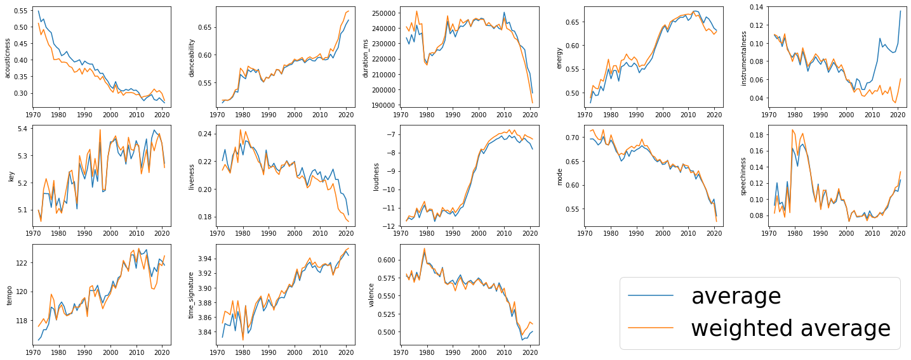

```python
import matplotlib.pyplot as plt
from collections import OrderedDict
import seaborn as sns

import pandas as pd

import plotly.graph_objects as go
import numpy as np
```


```python
import pyspark # only run after findspark.init()
from pyspark.sql import SparkSession 
from pyspark.conf import SparkConf
from pyspark.sql.functions import *
from pyspark.mllib.stat import Statistics
from pyspark.sql.types import StringType, IntegerType, StructType, StructField
```


```python
spark = SparkSession \
    .builder \
    .appName("regression") \
    .master("local[4]") \
    .config("spark.driver.maxResultSize", "8g") \
    .config("spark.network.timeout","3600")\
    .config("spark.executor.heartbeatInterval","3000s")\
    .getOrCreate()
```

# TREND ANALYSIS


```python
df = spark.read.json('../data/cleaned_dataset')
df.show(3,truncate=False,vertical =True)

```

    -RECORD 0---------------------------------------------------------------------------------------------------------------------------------------------------
     acousticness          | 0.658                                                                                                                              
     age                   | 41.821917808219176                                                                                                                 
     avg_artist_followers  | 5403.5                                                                                                                             
     avg_artist_popularity | 40.0                                                                                                                               
     danceability          | 0.602                                                                                                                              
     duration_ms           | 156067                                                                                                                             
     energy                | 0.552                                                                                                                              
     genres                | [classic czech pop, czech folk, czech rock]                                                                                        
     id_track              | 00AeAaSNbe92PRrstQskvH                                                                                                             
     instrumentalness      | 0.0                                                                                                                                
     key                   | 0                                                                                                                                  
     liveness              | 0.0972                                                                                                                             
     loudness              | -6.667                                                                                                                             
     mode                  | 1                                                                                                                                  
     popularity_track      | 3                                                                                                                                  
     release_date          | 1980-01-01                                                                                                                         
     speechiness           | 0.404                                                                                                                              
     sum_artist_followers  | 10807                                                                                                                              
     sum_artist_popularity | 80                                                                                                                                 
     tempo                 | 182.229                                                                                                                            
     time_signature        | 3                                                                                                                                  
     valence               | 0.65                                                                                                                               
    -RECORD 1---------------------------------------------------------------------------------------------------------------------------------------------------
     acousticness          | 0.543                                                                                                                              
     age                   | 45.824657534246576                                                                                                                 
     avg_artist_followers  | 19833.0                                                                                                                            
     avg_artist_popularity | 43.0                                                                                                                               
     danceability          | 0.77                                                                                                                               
     duration_ms           | 220133                                                                                                                             
     energy                | 0.891                                                                                                                              
     genres                | [afrobeat, afropop, world]                                                                                                         
     id_track              | 00DJt4PjkzeXhKKVDekw2n                                                                                                             
     instrumentalness      | 7.96E-4                                                                                                                            
     key                   | 1                                                                                                                                  
     liveness              | 0.0684                                                                                                                             
     loudness              | -7.306                                                                                                                             
     mode                  | 1                                                                                                                                  
     popularity_track      | 9                                                                                                                                  
     release_date          | 1976-01-01                                                                                                                         
     speechiness           | 0.172                                                                                                                              
     sum_artist_followers  | 19833                                                                                                                              
     sum_artist_popularity | 43                                                                                                                                 
     tempo                 | 135.573                                                                                                                            
     time_signature        | 4                                                                                                                                  
     valence               | 0.898                                                                                                                              
    -RECORD 2---------------------------------------------------------------------------------------------------------------------------------------------------
     acousticness          | 4.8E-5                                                                                                                             
     age                   | 25.673972602739727                                                                                                                 
     avg_artist_followers  | 874600.0                                                                                                                           
     avg_artist_popularity | 68.0                                                                                                                               
     danceability          | 0.212                                                                                                                              
     duration_ms           | 250960                                                                                                                             
     energy                | 0.986                                                                                                                              
     genres                | [alternative metal, gothenburg metal, melodic death metal, melodic metalcore, metal, nu metal, swedish death metal, swedish metal] 
     id_track              | 00HgVIkZrAL8WjAN9Et6WW                                                                                                             
     instrumentalness      | 0.918                                                                                                                              
     key                   | 0                                                                                                                                  
     liveness              | 0.324                                                                                                                              
     loudness              | -6.69                                                                                                                              
     mode                  | 0                                                                                                                                  
     popularity_track      | 33                                                                                                                                 
     release_date          | 1996-02-20                                                                                                                         
     speechiness           | 0.14                                                                                                                               
     sum_artist_followers  | 874600                                                                                                                             
     sum_artist_popularity | 68                                                                                                                                 
     tempo                 | 140.917                                                                                                                            
     time_signature        | 4                                                                                                                                  
     valence               | 0.231                                                                                                                              
    only showing top 3 rows
    
    


```python

technical_columns = ['acousticness', 'danceability', 'duration_ms', 'energy', 'instrumentalness', 'key', 'liveness', 'loudness', 'mode',  'speechiness', 'tempo', 'time_signature', 'valence']
```


```python
from pyspark.sql.window import Window

df = df.withColumn('year',2021 - df.age.cast(IntegerType()))

windowSpec = Window.partitionBy("year") 
df = df.withColumn("popularity_norma",sum(col("popularity_track")).over(windowSpec))
df.select('year','popularity_norma').show()


```

    +----+----------------+
    |year|popularity_norma|
    +----+----------------+
    |1959|           59595|
    |1959|           59595|
    |1959|           59595|
    |1959|           59595|
    |1959|           59595|
    |1959|           59595|
    |1959|           59595|
    |1959|           59595|
    |1959|           59595|
    |1959|           59595|
    |1959|           59595|
    |1959|           59595|
    |1959|           59595|
    |1959|           59595|
    |1959|           59595|
    |1959|           59595|
    |1959|           59595|
    |1959|           59595|
    |1959|           59595|
    |1959|           59595|
    +----+----------------+
    only showing top 20 rows
    
    


```python
from functools import reduce
```


```python


dfn = reduce(
    lambda memo_df, col_name: memo_df.withColumn(col_name+'_n', (col(col_name)*col('popularity_track')/col('popularity_norma'))  ),technical_columns,df)

dfn
```


    DataFrame[acousticness: double, age: double, avg_artist_followers: double, avg_artist_popularity: double, danceability: double, duration_ms: bigint, energy: double, genres: array<string>, id_track: string, instrumentalness: double, key: bigint, liveness: double, loudness: double, mode: bigint, popularity_track: bigint, release_date: string, speechiness: double, sum_artist_followers: bigint, sum_artist_popularity: bigint, tempo: double, time_signature: bigint, valence: double, year: int, popularity_norma: bigint, acousticness_n: double, danceability_n: double, duration_ms_n: double, energy_n: double, instrumentalness_n: double, key_n: double, liveness_n: double, loudness_n: double, mode_n: double, speechiness_n: double, tempo_n: double, time_signature_n: double, valence_n: double]


```python
dfn.show(3,vertical = True)
```

    -RECORD 0-------------------------------------
     acousticness          | 0.568                
     age                   | 62.824657534246576   
     avg_artist_followers  | 208410.0             
     avg_artist_popularity | 57.0                 
     danceability          | 0.608                
     duration_ms           | 164067               
     energy                | 0.561                
     genres                | [adult standards,... 
     id_track              | 07BBsPSNZPEu21LDs... 
     instrumentalness      | 2.01E-5              
     key                   | 0                    
     liveness              | 0.0934               
     loudness              | -10.313              
     mode                  | 1                    
     popularity_track      | 11                   
     release_date          | 1959-01-05           
     speechiness           | 0.032                
     sum_artist_followers  | 208410               
     sum_artist_popularity | 57                   
     tempo                 | 112.796              
     time_signature        | 4                    
     valence               | 0.83                 
     year                  | 1959                 
     popularity_norma      | 59595                
     acousticness_n        | 1.048410101518583... 
     danceability_n        | 1.122241798808624... 
     duration_ms_n         | 30.283362698212937   
     energy_n              | 1.035489554492826... 
     instrumentalness_n    | 3.710042788824566E-9 
     key_n                 | 0.0                  
     liveness_n            | 1.723970131722459... 
     loudness_n            | -0.00190356573538... 
     mode_n                | 1.845792432251027... 
     speechiness_n         | 5.906535783203289E-6 
     tempo_n               | 0.020819800318818693 
     time_signature_n      | 7.383169729004111E-4 
     valence_n             | 1.532007718768353E-4 
    -RECORD 1-------------------------------------
     acousticness          | 0.947                
     age                   | 62.83561643835616    
     avg_artist_followers  | 1975077.0            
     avg_artist_popularity | 65.0                 
     danceability          | 0.668                
     duration_ms           | 190160               
     energy                | 0.115                
     genres                | [chutney, classic... 
     id_track              | 0ANXlmmeIQCr3u4uN... 
     instrumentalness      | 6.24E-4              
     key                   | 7                    
     liveness              | 0.428                
     loudness              | -16.732              
     mode                  | 0                    
     popularity_track      | 2                    
     release_date          | 1959-01-01           
     speechiness           | 0.073                
     sum_artist_followers  | 1975077              
     sum_artist_popularity | 65                   
     tempo                 | 132.698              
     time_signature        | 3                    
     valence               | 0.649                
     year                  | 1959                 
     popularity_norma      | 59595                
     acousticness_n        | 3.178118969712224E-5 
     danceability_n        | 2.241798808624884... 
     duration_ms_n         | 6.381743434851917    
     energy_n              | 3.859384176524877E-6 
     instrumentalness_n    | 2.094135414044802... 
     key_n                 | 2.34919036831949E-4  
     liveness_n            | 1.436362110915345... 
     loudness_n            | -5.61523617753167... 
     mode_n                | 0.0                  
     speechiness_n         | 2.449869955533182... 
     tempo_n               | 0.004453326621360853 
     time_signature_n      | 1.006795872136924... 
     valence_n             | 2.178035070056213E-5 
    -RECORD 2-------------------------------------
     acousticness          | 0.892                
     age                   | 62.83561643835616    
     avg_artist_followers  | 224568.0             
     avg_artist_popularity | 54.0                 
     danceability          | 0.475                
     duration_ms           | 320427               
     energy                | 0.19                 
     genres                | [bebop, cool jazz... 
     id_track              | 0yBEvLfd3qlBMJVli... 
     instrumentalness      | 2.66E-4              
     key                   | 8                    
     liveness              | 0.109                
     loudness              | -12.241              
     mode                  | 1                    
     popularity_track      | 36                   
     release_date          | 1959-01-01           
     speechiness           | 0.0327               
     sum_artist_followers  | 224568               
     sum_artist_popularity | 54                   
     tempo                 | 116.708              
     time_signature        | 4                    
     valence               | 0.113                
     year                  | 1959                 
     popularity_norma      | 59595                
     acousticness_n        | 5.388371507676819E-4 
     danceability_n        | 2.869368235590234E-4 
     duration_ms_n         | 193.56274855273094   
     energy_n              | 1.147747294236093... 
     instrumentalness_n    | 1.606846211930531... 
     key_n                 | 0.004832620186257236 
     liveness_n            | 6.584445003775484E-5 
     loudness_n            | -0.00739451296249... 
     mode_n                | 6.040775232821545E-4 
     speechiness_n         | 1.975333501132645... 
     tempo_n               | 0.07050067958721369  
     time_signature_n      | 0.002416310093128618 
     valence_n             | 6.826076013088348E-5 
    only showing top 3 rows
    
    


```python
for column in technical_columns:
    for aggr in ['min','max','avg']:
        s = "F."+aggr+"('"+column+"').alias('"+aggr+"_"+column+"'),\\"
        print(s,end='\n')
    print("F.sum('"+column+"_n').alias('wavg_"+column+"'),\\")
    
```

    F.min('acousticness').alias('min_acousticness'),\
    F.max('acousticness').alias('max_acousticness'),\
    F.avg('acousticness').alias('avg_acousticness'),\
    F.sum('acousticness_n').alias('wavg_acousticness'),\
    F.min('danceability').alias('min_danceability'),\
    F.max('danceability').alias('max_danceability'),\
    F.avg('danceability').alias('avg_danceability'),\
    F.sum('danceability_n').alias('wavg_danceability'),\
    F.min('duration_ms').alias('min_duration_ms'),\
    F.max('duration_ms').alias('max_duration_ms'),\
    F.avg('duration_ms').alias('avg_duration_ms'),\
    F.sum('duration_ms_n').alias('wavg_duration_ms'),\
    F.min('energy').alias('min_energy'),\
    F.max('energy').alias('max_energy'),\
    F.avg('energy').alias('avg_energy'),\
    F.sum('energy_n').alias('wavg_energy'),\
    F.min('instrumentalness').alias('min_instrumentalness'),\
    F.max('instrumentalness').alias('max_instrumentalness'),\
    F.avg('instrumentalness').alias('avg_instrumentalness'),\
    F.sum('instrumentalness_n').alias('wavg_instrumentalness'),\
    F.min('key').alias('min_key'),\
    F.max('key').alias('max_key'),\
    F.avg('key').alias('avg_key'),\
    F.sum('key_n').alias('wavg_key'),\
    F.min('liveness').alias('min_liveness'),\
    F.max('liveness').alias('max_liveness'),\
    F.avg('liveness').alias('avg_liveness'),\
    F.sum('liveness_n').alias('wavg_liveness'),\
    F.min('loudness').alias('min_loudness'),\
    F.max('loudness').alias('max_loudness'),\
    F.avg('loudness').alias('avg_loudness'),\
    F.sum('loudness_n').alias('wavg_loudness'),\
    F.min('mode').alias('min_mode'),\
    F.max('mode').alias('max_mode'),\
    F.avg('mode').alias('avg_mode'),\
    F.sum('mode_n').alias('wavg_mode'),\
    F.min('speechiness').alias('min_speechiness'),\
    F.max('speechiness').alias('max_speechiness'),\
    F.avg('speechiness').alias('avg_speechiness'),\
    F.sum('speechiness_n').alias('wavg_speechiness'),\
    F.min('tempo').alias('min_tempo'),\
    F.max('tempo').alias('max_tempo'),\
    F.avg('tempo').alias('avg_tempo'),\
    F.sum('tempo_n').alias('wavg_tempo'),\
    F.min('time_signature').alias('min_time_signature'),\
    F.max('time_signature').alias('max_time_signature'),\
    F.avg('time_signature').alias('avg_time_signature'),\
    F.sum('time_signature_n').alias('wavg_time_signature'),\
    F.min('valence').alias('min_valence'),\
    F.max('valence').alias('max_valence'),\
    F.avg('valence').alias('avg_valence'),\
    F.sum('valence_n').alias('wavg_valence'),\
    


```python
import pyspark.sql.functions as F
```


```python

dfg = dfn.groupBy('year')\
    .agg(F.min('acousticness').alias('min_acousticness'),\
        F.max('acousticness').alias('max_acousticness'),\
        F.avg('acousticness').alias('avg_acousticness'),\
        F.sum('acousticness_n').alias('wavg_acousticness'),\
        F.min('danceability').alias('min_danceability'),\
        F.max('danceability').alias('max_danceability'),\
        F.avg('danceability').alias('avg_danceability'),\
        F.sum('danceability_n').alias('wavg_danceability'),\
        F.min('duration_ms').alias('min_duration_ms'),\
        F.max('duration_ms').alias('max_duration_ms'),\
        F.avg('duration_ms').alias('avg_duration_ms'),\
        F.sum('duration_ms_n').alias('wavg_duration_ms'),\
        F.min('energy').alias('min_energy'),\
        F.max('energy').alias('max_energy'),\
        F.avg('energy').alias('avg_energy'),\
        F.sum('energy_n').alias('wavg_energy'),\
        F.min('instrumentalness').alias('min_instrumentalness'),\
        F.max('instrumentalness').alias('max_instrumentalness'),\
        F.avg('instrumentalness').alias('avg_instrumentalness'),\
        F.sum('instrumentalness_n').alias('wavg_instrumentalness'),\
        F.min('key').alias('min_key'),\
        F.max('key').alias('max_key'),\
        F.avg('key').alias('avg_key'),\
        F.sum('key_n').alias('wavg_key'),\
        F.min('liveness').alias('min_liveness'),\
        F.max('liveness').alias('max_liveness'),\
        F.avg('liveness').alias('avg_liveness'),\
        F.sum('liveness_n').alias('wavg_liveness'),\
        F.min('loudness').alias('min_loudness'),\
        F.max('loudness').alias('max_loudness'),\
        F.avg('loudness').alias('avg_loudness'),\
        F.sum('loudness_n').alias('wavg_loudness'),\
        F.min('mode').alias('min_mode'),\
        F.max('mode').alias('max_mode'),\
        F.avg('mode').alias('avg_mode'),\
        F.sum('mode_n').alias('wavg_mode'),\
        F.min('speechiness').alias('min_speechiness'),\
        F.max('speechiness').alias('max_speechiness'),\
        F.avg('speechiness').alias('avg_speechiness'),\
        F.sum('speechiness_n').alias('wavg_speechiness'),\
        F.min('tempo').alias('min_tempo'),\
        F.max('tempo').alias('max_tempo'),\
        F.avg('tempo').alias('avg_tempo'),\
        F.sum('tempo_n').alias('wavg_tempo'),\
        F.min('time_signature').alias('min_time_signature'),\
        F.max('time_signature').alias('max_time_signature'),\
        F.avg('time_signature').alias('avg_time_signature'),\
        F.sum('time_signature_n').alias('wavg_time_signature'),\
        F.min('valence').alias('min_valence'),\
        F.max('valence').alias('max_valence'),\
        F.avg('valence').alias('avg_valence'),\
        F.sum('valence_n').alias('wavg_valence') )
```


```python
dfg.printSchema()
```

    root
     |-- year: integer (nullable = true)
     |-- min_acousticness: double (nullable = true)
     |-- max_acousticness: double (nullable = true)
     |-- avg_acousticness: double (nullable = true)
     |-- wavg_acousticness: double (nullable = true)
     |-- min_danceability: double (nullable = true)
     |-- max_danceability: double (nullable = true)
     |-- avg_danceability: double (nullable = true)
     |-- wavg_danceability: double (nullable = true)
     |-- min_duration_ms: long (nullable = true)
     |-- max_duration_ms: long (nullable = true)
     |-- avg_duration_ms: double (nullable = true)
     |-- wavg_duration_ms: double (nullable = true)
     |-- min_energy: double (nullable = true)
     |-- max_energy: double (nullable = true)
     |-- avg_energy: double (nullable = true)
     |-- wavg_energy: double (nullable = true)
     |-- min_instrumentalness: double (nullable = true)
     |-- max_instrumentalness: double (nullable = true)
     |-- avg_instrumentalness: double (nullable = true)
     |-- wavg_instrumentalness: double (nullable = true)
     |-- min_key: long (nullable = true)
     |-- max_key: long (nullable = true)
     |-- avg_key: double (nullable = true)
     |-- wavg_key: double (nullable = true)
     |-- min_liveness: double (nullable = true)
     |-- max_liveness: double (nullable = true)
     |-- avg_liveness: double (nullable = true)
     |-- wavg_liveness: double (nullable = true)
     |-- min_loudness: double (nullable = true)
     |-- max_loudness: double (nullable = true)
     |-- avg_loudness: double (nullable = true)
     |-- wavg_loudness: double (nullable = true)
     |-- min_mode: long (nullable = true)
     |-- max_mode: long (nullable = true)
     |-- avg_mode: double (nullable = true)
     |-- wavg_mode: double (nullable = true)
     |-- min_speechiness: double (nullable = true)
     |-- max_speechiness: double (nullable = true)
     |-- avg_speechiness: double (nullable = true)
     |-- wavg_speechiness: double (nullable = true)
     |-- min_tempo: double (nullable = true)
     |-- max_tempo: double (nullable = true)
     |-- avg_tempo: double (nullable = true)
     |-- wavg_tempo: double (nullable = true)
     |-- min_time_signature: long (nullable = true)
     |-- max_time_signature: long (nullable = true)
     |-- avg_time_signature: double (nullable = true)
     |-- wavg_time_signature: double (nullable = true)
     |-- min_valence: double (nullable = true)
     |-- max_valence: double (nullable = true)
     |-- avg_valence: double (nullable = true)
     |-- wavg_valence: double (nullable = true)
    
    


```python
dfg.count()
```


    101


```python
dfp = dfg.toPandas()
```


```python
dfp.to_csv('../data/timeseries.csv')
```

### Design Trends


```python

technical_columns = ['acousticness', 'danceability', 'duration_ms', 'energy', 'instrumentalness', 'key', 'liveness', 'loudness', 'mode',  'speechiness', 'tempo', 'time_signature', 'valence']
```


```python
dfp = pd.read_csv('../data/timeseries.csv',index_col=0)
dfp
```


<div>
<style scoped>
    .dataframe tbody tr th:only-of-type {
        vertical-align: middle;
    }

    .dataframe tbody tr th {
        vertical-align: top;
    }

    .dataframe thead th {
        text-align: right;
    }
</style>
<table border="1" class="dataframe">
  <thead>
    <tr style="text-align: right;">
      <th></th>
      <th>year</th>
      <th>min_acousticness</th>
      <th>max_acousticness</th>
      <th>avg_acousticness</th>
      <th>wavg_acousticness</th>
      <th>min_danceability</th>
      <th>max_danceability</th>
      <th>avg_danceability</th>
      <th>wavg_danceability</th>
      <th>min_duration_ms</th>
      <th>...</th>
      <th>avg_tempo</th>
      <th>wavg_tempo</th>
      <th>min_time_signature</th>
      <th>max_time_signature</th>
      <th>avg_time_signature</th>
      <th>wavg_time_signature</th>
      <th>min_valence</th>
      <th>max_valence</th>
      <th>avg_valence</th>
      <th>wavg_valence</th>
    </tr>
  </thead>
  <tbody>
    <tr>
      <th>0</th>
      <td>1959</td>
      <td>0.000463</td>
      <td>0.996</td>
      <td>0.797920</td>
      <td>0.781117</td>
      <td>0.0000</td>
      <td>0.952</td>
      <td>0.484321</td>
      <td>0.492480</td>
      <td>30040</td>
      <td>...</td>
      <td>111.872823</td>
      <td>112.341744</td>
      <td>0</td>
      <td>5</td>
      <td>3.780429</td>
      <td>3.791023</td>
      <td>0.0000</td>
      <td>0.989</td>
      <td>0.508534</td>
      <td>0.505048</td>
    </tr>
    <tr>
      <th>1</th>
      <td>1990</td>
      <td>0.000001</td>
      <td>0.996</td>
      <td>0.396070</td>
      <td>0.374543</td>
      <td>0.0000</td>
      <td>0.985</td>
      <td>0.557751</td>
      <td>0.557459</td>
      <td>30467</td>
      <td>...</td>
      <td>119.539611</td>
      <td>119.557828</td>
      <td>0</td>
      <td>5</td>
      <td>3.883712</td>
      <td>3.891658</td>
      <td>0.0000</td>
      <td>0.990</td>
      <td>0.571420</td>
      <td>0.566846</td>
    </tr>
    <tr>
      <th>2</th>
      <td>1975</td>
      <td>0.000005</td>
      <td>0.996</td>
      <td>0.497883</td>
      <td>0.466204</td>
      <td>0.0641</td>
      <td>0.947</td>
      <td>0.519428</td>
      <td>0.520134</td>
      <td>31280</td>
      <td>...</td>
      <td>117.324881</td>
      <td>117.781037</td>
      <td>1</td>
      <td>5</td>
      <td>3.848027</td>
      <td>3.862974</td>
      <td>0.0000</td>
      <td>0.994</td>
      <td>0.571237</td>
      <td>0.568436</td>
    </tr>
    <tr>
      <th>3</th>
      <td>1977</td>
      <td>0.000002</td>
      <td>0.996</td>
      <td>0.481638</td>
      <td>0.435098</td>
      <td>0.0000</td>
      <td>0.955</td>
      <td>0.534042</td>
      <td>0.536507</td>
      <td>30107</td>
      <td>...</td>
      <td>118.901668</td>
      <td>119.799414</td>
      <td>0</td>
      <td>5</td>
      <td>3.841072</td>
      <td>3.857665</td>
      <td>0.0000</td>
      <td>1.000</td>
      <td>0.572814</td>
      <td>0.571493</td>
    </tr>
    <tr>
      <th>4</th>
      <td>1924</td>
      <td>0.000847</td>
      <td>0.996</td>
      <td>0.833162</td>
      <td>0.971090</td>
      <td>0.0000</td>
      <td>0.869</td>
      <td>0.628769</td>
      <td>0.628067</td>
      <td>97493</td>
      <td>...</td>
      <td>113.414818</td>
      <td>105.523046</td>
      <td>0</td>
      <td>5</td>
      <td>3.650972</td>
      <td>3.956186</td>
      <td>0.0000</td>
      <td>0.977</td>
      <td>0.610186</td>
      <td>0.638443</td>
    </tr>
    <tr>
      <th>...</th>
      <td>...</td>
      <td>...</td>
      <td>...</td>
      <td>...</td>
      <td>...</td>
      <td>...</td>
      <td>...</td>
      <td>...</td>
      <td>...</td>
      <td>...</td>
      <td>...</td>
      <td>...</td>
      <td>...</td>
      <td>...</td>
      <td>...</td>
      <td>...</td>
      <td>...</td>
      <td>...</td>
      <td>...</td>
      <td>...</td>
      <td>...</td>
    </tr>
    <tr>
      <th>96</th>
      <td>1929</td>
      <td>0.121000</td>
      <td>0.996</td>
      <td>0.954023</td>
      <td>0.886166</td>
      <td>0.0912</td>
      <td>0.937</td>
      <td>0.605083</td>
      <td>0.601927</td>
      <td>62212</td>
      <td>...</td>
      <td>118.917433</td>
      <td>114.230870</td>
      <td>1</td>
      <td>5</td>
      <td>3.862038</td>
      <td>3.966321</td>
      <td>0.0338</td>
      <td>0.973</td>
      <td>0.648447</td>
      <td>0.638408</td>
    </tr>
    <tr>
      <th>97</th>
      <td>1928</td>
      <td>0.000131</td>
      <td>0.996</td>
      <td>0.940836</td>
      <td>0.950886</td>
      <td>0.0650</td>
      <td>0.901</td>
      <td>0.541183</td>
      <td>0.540457</td>
      <td>34133</td>
      <td>...</td>
      <td>109.107917</td>
      <td>114.833777</td>
      <td>1</td>
      <td>5</td>
      <td>3.816401</td>
      <td>3.807901</td>
      <td>0.0324</td>
      <td>0.976</td>
      <td>0.522406</td>
      <td>0.484554</td>
    </tr>
    <tr>
      <th>98</th>
      <td>1933</td>
      <td>0.004040</td>
      <td>0.996</td>
      <td>0.830922</td>
      <td>0.918262</td>
      <td>0.0623</td>
      <td>0.920</td>
      <td>0.591387</td>
      <td>0.620005</td>
      <td>57980</td>
      <td>...</td>
      <td>112.571244</td>
      <td>111.709462</td>
      <td>1</td>
      <td>5</td>
      <td>3.783472</td>
      <td>3.913198</td>
      <td>0.0340</td>
      <td>0.979</td>
      <td>0.599417</td>
      <td>0.598855</td>
    </tr>
    <tr>
      <th>99</th>
      <td>2021</td>
      <td>0.000001</td>
      <td>0.996</td>
      <td>0.270236</td>
      <td>0.277338</td>
      <td>0.0000</td>
      <td>0.987</td>
      <td>0.662397</td>
      <td>0.678670</td>
      <td>23493</td>
      <td>...</td>
      <td>121.818194</td>
      <td>122.464807</td>
      <td>0</td>
      <td>5</td>
      <td>3.944104</td>
      <td>3.953721</td>
      <td>0.0000</td>
      <td>0.986</td>
      <td>0.500156</td>
      <td>0.510634</td>
    </tr>
    <tr>
      <th>100</th>
      <td>1993</td>
      <td>0.000001</td>
      <td>0.996</td>
      <td>0.386889</td>
      <td>0.365236</td>
      <td>0.0000</td>
      <td>0.978</td>
      <td>0.573121</td>
      <td>0.573493</td>
      <td>12678</td>
      <td>...</td>
      <td>120.047207</td>
      <td>120.396114</td>
      <td>0</td>
      <td>5</td>
      <td>3.876909</td>
      <td>3.882142</td>
      <td>0.0000</td>
      <td>0.996</td>
      <td>0.578859</td>
      <td>0.575349</td>
    </tr>
  </tbody>
</table>
<p>101 rows × 53 columns</p>
</div>


```python
dfp = dfp[dfp.year>1971]
dfp.set_index('year',inplace = True,drop=True)
dfp.sort_index(inplace=True)

```

    C:\Users\carlo\anaconda3\envs\pyspark_env\lib\site-packages\pandas\core\frame.py:6402: SettingWithCopyWarning: 
    A value is trying to be set on a copy of a slice from a DataFrame
    
    See the caveats in the documentation: https://pandas.pydata.org/pandas-docs/stable/user_guide/indexing.html#returning-a-view-versus-a-copy
      key,
    


```python
dfp
```


<div>
<style scoped>
    .dataframe tbody tr th:only-of-type {
        vertical-align: middle;
    }

    .dataframe tbody tr th {
        vertical-align: top;
    }

    .dataframe thead th {
        text-align: right;
    }
</style>
<table border="1" class="dataframe">
  <thead>
    <tr style="text-align: right;">
      <th></th>
      <th>min_acousticness</th>
      <th>max_acousticness</th>
      <th>avg_acousticness</th>
      <th>wavg_acousticness</th>
      <th>min_danceability</th>
      <th>max_danceability</th>
      <th>avg_danceability</th>
      <th>wavg_danceability</th>
      <th>min_duration_ms</th>
      <th>max_duration_ms</th>
      <th>...</th>
      <th>avg_tempo</th>
      <th>wavg_tempo</th>
      <th>min_time_signature</th>
      <th>max_time_signature</th>
      <th>avg_time_signature</th>
      <th>wavg_time_signature</th>
      <th>min_valence</th>
      <th>max_valence</th>
      <th>avg_valence</th>
      <th>wavg_valence</th>
    </tr>
    <tr>
      <th>year</th>
      <th></th>
      <th></th>
      <th></th>
      <th></th>
      <th></th>
      <th></th>
      <th></th>
      <th></th>
      <th></th>
      <th></th>
      <th></th>
      <th></th>
      <th></th>
      <th></th>
      <th></th>
      <th></th>
      <th></th>
      <th></th>
      <th></th>
      <th></th>
      <th></th>
    </tr>
  </thead>
  <tbody>
    <tr>
      <th>1972</th>
      <td>0.000007</td>
      <td>0.996</td>
      <td>0.546940</td>
      <td>0.510003</td>
      <td>0.0000</td>
      <td>0.921</td>
      <td>0.513294</td>
      <td>0.518027</td>
      <td>31453</td>
      <td>4142067</td>
      <td>...</td>
      <td>116.609066</td>
      <td>117.566475</td>
      <td>0</td>
      <td>5</td>
      <td>3.832303</td>
      <td>3.851738</td>
      <td>0.00000</td>
      <td>0.988</td>
      <td>0.577270</td>
      <td>0.579952</td>
    </tr>
    <tr>
      <th>1973</th>
      <td>0.000004</td>
      <td>0.996</td>
      <td>0.514682</td>
      <td>0.475376</td>
      <td>0.0000</td>
      <td>0.942</td>
      <td>0.518486</td>
      <td>0.518216</td>
      <td>14708</td>
      <td>2052573</td>
      <td>...</td>
      <td>116.818559</td>
      <td>117.818373</td>
      <td>0</td>
      <td>5</td>
      <td>3.850962</td>
      <td>3.867799</td>
      <td>0.00000</td>
      <td>0.989</td>
      <td>0.574577</td>
      <td>0.571809</td>
    </tr>
    <tr>
      <th>1974</th>
      <td>0.000003</td>
      <td>0.996</td>
      <td>0.522935</td>
      <td>0.491428</td>
      <td>0.0000</td>
      <td>0.946</td>
      <td>0.517479</td>
      <td>0.517561</td>
      <td>30067</td>
      <td>3153173</td>
      <td>...</td>
      <td>117.329357</td>
      <td>118.097608</td>
      <td>0</td>
      <td>5</td>
      <td>3.848920</td>
      <td>3.865882</td>
      <td>0.00000</td>
      <td>0.992</td>
      <td>0.580689</td>
      <td>0.584793</td>
    </tr>
    <tr>
      <th>1975</th>
      <td>0.000005</td>
      <td>0.996</td>
      <td>0.497883</td>
      <td>0.466204</td>
      <td>0.0641</td>
      <td>0.947</td>
      <td>0.519428</td>
      <td>0.520134</td>
      <td>31280</td>
      <td>3091707</td>
      <td>...</td>
      <td>117.324881</td>
      <td>117.781037</td>
      <td>1</td>
      <td>5</td>
      <td>3.848027</td>
      <td>3.862974</td>
      <td>0.00000</td>
      <td>0.994</td>
      <td>0.571237</td>
      <td>0.568436</td>
    </tr>
    <tr>
      <th>1976</th>
      <td>0.000004</td>
      <td>0.995</td>
      <td>0.488774</td>
      <td>0.445149</td>
      <td>0.0717</td>
      <td>0.944</td>
      <td>0.523765</td>
      <td>0.525523</td>
      <td>30667</td>
      <td>3377907</td>
      <td>...</td>
      <td>117.723843</td>
      <td>118.173898</td>
      <td>0</td>
      <td>5</td>
      <td>3.864226</td>
      <td>3.882220</td>
      <td>0.02420</td>
      <td>0.994</td>
      <td>0.582466</td>
      <td>0.579731</td>
    </tr>
    <tr>
      <th>1977</th>
      <td>0.000002</td>
      <td>0.996</td>
      <td>0.481638</td>
      <td>0.435098</td>
      <td>0.0000</td>
      <td>0.955</td>
      <td>0.534042</td>
      <td>0.536507</td>
      <td>30107</td>
      <td>1750875</td>
      <td>...</td>
      <td>118.901668</td>
      <td>119.799414</td>
      <td>0</td>
      <td>5</td>
      <td>3.841072</td>
      <td>3.857665</td>
      <td>0.00000</td>
      <td>1.000</td>
      <td>0.572814</td>
      <td>0.571493</td>
    </tr>
    <tr>
      <th>1978</th>
      <td>0.000000</td>
      <td>0.996</td>
      <td>0.447950</td>
      <td>0.400609</td>
      <td>0.0000</td>
      <td>0.956</td>
      <td>0.532305</td>
      <td>0.538369</td>
      <td>31265</td>
      <td>3441840</td>
      <td>...</td>
      <td>118.763320</td>
      <td>119.388872</td>
      <td>0</td>
      <td>5</td>
      <td>3.867481</td>
      <td>3.882232</td>
      <td>0.00000</td>
      <td>1.000</td>
      <td>0.592228</td>
      <td>0.596055</td>
    </tr>
    <tr>
      <th>1979</th>
      <td>0.000000</td>
      <td>0.996</td>
      <td>0.438439</td>
      <td>0.400940</td>
      <td>0.0000</td>
      <td>0.947</td>
      <td>0.564431</td>
      <td>0.575700</td>
      <td>30400</td>
      <td>5621218</td>
      <td>...</td>
      <td>118.003438</td>
      <td>118.017765</td>
      <td>0</td>
      <td>5</td>
      <td>3.853822</td>
      <td>3.860698</td>
      <td>0.00000</td>
      <td>0.997</td>
      <td>0.610295</td>
      <td>0.615718</td>
    </tr>
    <tr>
      <th>1980</th>
      <td>0.000007</td>
      <td>0.996</td>
      <td>0.431627</td>
      <td>0.403211</td>
      <td>0.0000</td>
      <td>0.961</td>
      <td>0.559924</td>
      <td>0.570133</td>
      <td>30120</td>
      <td>2796951</td>
      <td>...</td>
      <td>118.994062</td>
      <td>118.784987</td>
      <td>0</td>
      <td>5</td>
      <td>3.832373</td>
      <td>3.828379</td>
      <td>0.00000</td>
      <td>0.991</td>
      <td>0.595041</td>
      <td>0.594361</td>
    </tr>
    <tr>
      <th>1981</th>
      <td>0.000003</td>
      <td>0.995</td>
      <td>0.412192</td>
      <td>0.392412</td>
      <td>0.0000</td>
      <td>0.980</td>
      <td>0.556562</td>
      <td>0.560257</td>
      <td>30107</td>
      <td>2578147</td>
      <td>...</td>
      <td>119.257420</td>
      <td>119.050791</td>
      <td>0</td>
      <td>5</td>
      <td>3.875487</td>
      <td>3.875205</td>
      <td>0.00000</td>
      <td>0.997</td>
      <td>0.595003</td>
      <td>0.593229</td>
    </tr>
    <tr>
      <th>1982</th>
      <td>0.000002</td>
      <td>0.996</td>
      <td>0.416641</td>
      <td>0.392965</td>
      <td>0.0636</td>
      <td>0.980</td>
      <td>0.572927</td>
      <td>0.579362</td>
      <td>31901</td>
      <td>2012801</td>
      <td>...</td>
      <td>118.944353</td>
      <td>118.474913</td>
      <td>1</td>
      <td>5</td>
      <td>3.837737</td>
      <td>3.845169</td>
      <td>0.02830</td>
      <td>0.996</td>
      <td>0.590910</td>
      <td>0.587752</td>
    </tr>
    <tr>
      <th>1983</th>
      <td>0.000001</td>
      <td>0.996</td>
      <td>0.425135</td>
      <td>0.391073</td>
      <td>0.0000</td>
      <td>0.985</td>
      <td>0.568935</td>
      <td>0.575747</td>
      <td>30307</td>
      <td>4585640</td>
      <td>...</td>
      <td>118.323625</td>
      <td>118.296971</td>
      <td>0</td>
      <td>5</td>
      <td>3.843311</td>
      <td>3.851781</td>
      <td>0.00000</td>
      <td>0.999</td>
      <td>0.581284</td>
      <td>0.587073</td>
    </tr>
    <tr>
      <th>1984</th>
      <td>0.000000</td>
      <td>0.996</td>
      <td>0.409482</td>
      <td>0.380157</td>
      <td>0.0000</td>
      <td>0.964</td>
      <td>0.573488</td>
      <td>0.574546</td>
      <td>30280</td>
      <td>1575107</td>
      <td>...</td>
      <td>118.443308</td>
      <td>118.373063</td>
      <td>0</td>
      <td>5</td>
      <td>3.860809</td>
      <td>3.866112</td>
      <td>0.00000</td>
      <td>0.985</td>
      <td>0.581402</td>
      <td>0.579201</td>
    </tr>
    <tr>
      <th>1985</th>
      <td>0.000001</td>
      <td>0.996</td>
      <td>0.401247</td>
      <td>0.376742</td>
      <td>0.0000</td>
      <td>0.980</td>
      <td>0.567639</td>
      <td>0.571721</td>
      <td>30773</td>
      <td>3650800</td>
      <td>...</td>
      <td>118.454998</td>
      <td>118.550500</td>
      <td>0</td>
      <td>5</td>
      <td>3.870670</td>
      <td>3.878357</td>
      <td>0.00000</td>
      <td>0.997</td>
      <td>0.576164</td>
      <td>0.578379</td>
    </tr>
    <tr>
      <th>1986</th>
      <td>0.000001</td>
      <td>0.996</td>
      <td>0.393308</td>
      <td>0.362247</td>
      <td>0.0000</td>
      <td>0.965</td>
      <td>0.573677</td>
      <td>0.571418</td>
      <td>30133</td>
      <td>3109721</td>
      <td>...</td>
      <td>119.143891</td>
      <td>118.921930</td>
      <td>0</td>
      <td>5</td>
      <td>3.880344</td>
      <td>3.883431</td>
      <td>0.00000</td>
      <td>0.992</td>
      <td>0.589199</td>
      <td>0.587805</td>
    </tr>
    <tr>
      <th>1987</th>
      <td>0.000000</td>
      <td>0.996</td>
      <td>0.396089</td>
      <td>0.365212</td>
      <td>0.0000</td>
      <td>0.971</td>
      <td>0.555277</td>
      <td>0.558965</td>
      <td>30040</td>
      <td>1793760</td>
      <td>...</td>
      <td>118.662031</td>
      <td>118.897900</td>
      <td>0</td>
      <td>5</td>
      <td>3.886437</td>
      <td>3.888557</td>
      <td>0.00000</td>
      <td>0.990</td>
      <td>0.569554</td>
      <td>0.567667</td>
    </tr>
    <tr>
      <th>1988</th>
      <td>0.000001</td>
      <td>0.996</td>
      <td>0.400035</td>
      <td>0.373677</td>
      <td>0.0598</td>
      <td>0.974</td>
      <td>0.550566</td>
      <td>0.551078</td>
      <td>34124</td>
      <td>4252694</td>
      <td>...</td>
      <td>119.097168</td>
      <td>118.908746</td>
      <td>1</td>
      <td>5</td>
      <td>3.868133</td>
      <td>3.872819</td>
      <td>0.00001</td>
      <td>0.996</td>
      <td>0.565936</td>
      <td>0.565365</td>
    </tr>
    <tr>
      <th>1989</th>
      <td>0.000001</td>
      <td>0.996</td>
      <td>0.384162</td>
      <td>0.356501</td>
      <td>0.0000</td>
      <td>0.988</td>
      <td>0.559356</td>
      <td>0.559032</td>
      <td>30053</td>
      <td>2526328</td>
      <td>...</td>
      <td>119.160841</td>
      <td>119.385736</td>
      <td>0</td>
      <td>5</td>
      <td>3.873545</td>
      <td>3.879548</td>
      <td>0.00000</td>
      <td>0.997</td>
      <td>0.569308</td>
      <td>0.567974</td>
    </tr>
    <tr>
      <th>1990</th>
      <td>0.000001</td>
      <td>0.996</td>
      <td>0.396070</td>
      <td>0.374543</td>
      <td>0.0000</td>
      <td>0.985</td>
      <td>0.557751</td>
      <td>0.557459</td>
      <td>30467</td>
      <td>2849150</td>
      <td>...</td>
      <td>119.539611</td>
      <td>119.557828</td>
      <td>0</td>
      <td>5</td>
      <td>3.883712</td>
      <td>3.891658</td>
      <td>0.00000</td>
      <td>0.990</td>
      <td>0.571420</td>
      <td>0.566846</td>
    </tr>
    <tr>
      <th>1991</th>
      <td>0.000001</td>
      <td>0.996</td>
      <td>0.390144</td>
      <td>0.363780</td>
      <td>0.0000</td>
      <td>0.979</td>
      <td>0.564302</td>
      <td>0.565961</td>
      <td>30267</td>
      <td>3312720</td>
      <td>...</td>
      <td>118.585992</td>
      <td>118.242682</td>
      <td>0</td>
      <td>5</td>
      <td>3.876061</td>
      <td>3.881260</td>
      <td>0.00000</td>
      <td>0.987</td>
      <td>0.565123</td>
      <td>0.556593</td>
    </tr>
    <tr>
      <th>1992</th>
      <td>0.000000</td>
      <td>0.996</td>
      <td>0.386938</td>
      <td>0.373552</td>
      <td>0.0632</td>
      <td>0.969</td>
      <td>0.562258</td>
      <td>0.562355</td>
      <td>30173</td>
      <td>1818122</td>
      <td>...</td>
      <td>120.058999</td>
      <td>120.279100</td>
      <td>1</td>
      <td>5</td>
      <td>3.873049</td>
      <td>3.869263</td>
      <td>0.01880</td>
      <td>1.000</td>
      <td>0.573076</td>
      <td>0.568444</td>
    </tr>
    <tr>
      <th>1993</th>
      <td>0.000001</td>
      <td>0.996</td>
      <td>0.386889</td>
      <td>0.365236</td>
      <td>0.0000</td>
      <td>0.978</td>
      <td>0.573121</td>
      <td>0.573493</td>
      <td>12678</td>
      <td>2276400</td>
      <td>...</td>
      <td>120.047207</td>
      <td>120.396114</td>
      <td>0</td>
      <td>5</td>
      <td>3.876909</td>
      <td>3.882142</td>
      <td>0.00000</td>
      <td>0.996</td>
      <td>0.578859</td>
      <td>0.575349</td>
    </tr>
    <tr>
      <th>1994</th>
      <td>0.000001</td>
      <td>0.996</td>
      <td>0.368257</td>
      <td>0.350150</td>
      <td>0.0000</td>
      <td>0.976</td>
      <td>0.572014</td>
      <td>0.572689</td>
      <td>30720</td>
      <td>3682254</td>
      <td>...</td>
      <td>120.058039</td>
      <td>119.623455</td>
      <td>0</td>
      <td>5</td>
      <td>3.885347</td>
      <td>3.886877</td>
      <td>0.00000</td>
      <td>0.996</td>
      <td>0.569635</td>
      <td>0.566242</td>
    </tr>
    <tr>
      <th>1995</th>
      <td>0.000001</td>
      <td>0.996</td>
      <td>0.371237</td>
      <td>0.350733</td>
      <td>0.0000</td>
      <td>0.975</td>
      <td>0.564994</td>
      <td>0.565575</td>
      <td>30387</td>
      <td>2445534</td>
      <td>...</td>
      <td>120.417596</td>
      <td>120.135933</td>
      <td>0</td>
      <td>5</td>
      <td>3.886736</td>
      <td>3.896023</td>
      <td>0.00000</td>
      <td>0.999</td>
      <td>0.565725</td>
      <td>0.558628</td>
    </tr>
    <tr>
      <th>1996</th>
      <td>0.000000</td>
      <td>0.996</td>
      <td>0.358920</td>
      <td>0.339835</td>
      <td>0.0000</td>
      <td>0.977</td>
      <td>0.576569</td>
      <td>0.581562</td>
      <td>30836</td>
      <td>4368000</td>
      <td>...</td>
      <td>119.697316</td>
      <td>119.444291</td>
      <td>0</td>
      <td>5</td>
      <td>3.886071</td>
      <td>3.891863</td>
      <td>0.00000</td>
      <td>0.990</td>
      <td>0.569335</td>
      <td>0.569375</td>
    </tr>
    <tr>
      <th>1997</th>
      <td>0.000001</td>
      <td>0.996</td>
      <td>0.359317</td>
      <td>0.349891</td>
      <td>0.0000</td>
      <td>0.980</td>
      <td>0.578634</td>
      <td>0.580030</td>
      <td>30133</td>
      <td>3218360</td>
      <td>...</td>
      <td>119.189299</td>
      <td>118.784957</td>
      <td>0</td>
      <td>5</td>
      <td>3.895430</td>
      <td>3.897002</td>
      <td>0.00000</td>
      <td>0.991</td>
      <td>0.571216</td>
      <td>0.568577</td>
    </tr>
    <tr>
      <th>1998</th>
      <td>0.000001</td>
      <td>0.996</td>
      <td>0.344889</td>
      <td>0.332545</td>
      <td>0.0000</td>
      <td>0.988</td>
      <td>0.581390</td>
      <td>0.583506</td>
      <td>6373</td>
      <td>4150309</td>
      <td>...</td>
      <td>119.685882</td>
      <td>119.223639</td>
      <td>0</td>
      <td>5</td>
      <td>3.902392</td>
      <td>3.904764</td>
      <td>0.00000</td>
      <td>0.995</td>
      <td>0.567074</td>
      <td>0.564809</td>
    </tr>
    <tr>
      <th>1999</th>
      <td>0.000001</td>
      <td>0.996</td>
      <td>0.335049</td>
      <td>0.324410</td>
      <td>0.0000</td>
      <td>0.967</td>
      <td>0.582692</td>
      <td>0.584994</td>
      <td>30840</td>
      <td>3478906</td>
      <td>...</td>
      <td>119.724294</td>
      <td>119.555370</td>
      <td>0</td>
      <td>5</td>
      <td>3.900689</td>
      <td>3.901560</td>
      <td>0.00000</td>
      <td>0.996</td>
      <td>0.570200</td>
      <td>0.570570</td>
    </tr>
    <tr>
      <th>2000</th>
      <td>0.000000</td>
      <td>0.996</td>
      <td>0.320298</td>
      <td>0.310104</td>
      <td>0.0608</td>
      <td>0.979</td>
      <td>0.589230</td>
      <td>0.592038</td>
      <td>31027</td>
      <td>3634149</td>
      <td>...</td>
      <td>120.037642</td>
      <td>119.841396</td>
      <td>1</td>
      <td>5</td>
      <td>3.907435</td>
      <td>3.913502</td>
      <td>0.00000</td>
      <td>0.995</td>
      <td>0.574590</td>
      <td>0.572807</td>
    </tr>
    <tr>
      <th>2001</th>
      <td>0.000002</td>
      <td>0.996</td>
      <td>0.313691</td>
      <td>0.301980</td>
      <td>0.0604</td>
      <td>0.974</td>
      <td>0.588602</td>
      <td>0.589456</td>
      <td>30133</td>
      <td>1807520</td>
      <td>...</td>
      <td>120.712607</td>
      <td>120.455484</td>
      <td>1</td>
      <td>5</td>
      <td>3.922698</td>
      <td>3.925485</td>
      <td>0.03060</td>
      <td>0.985</td>
      <td>0.571358</td>
      <td>0.567760</td>
    </tr>
    <tr>
      <th>2002</th>
      <td>0.000000</td>
      <td>0.996</td>
      <td>0.334151</td>
      <td>0.324610</td>
      <td>0.0000</td>
      <td>0.991</td>
      <td>0.589991</td>
      <td>0.592083</td>
      <td>30240</td>
      <td>3639107</td>
      <td>...</td>
      <td>120.246735</td>
      <td>120.206107</td>
      <td>0</td>
      <td>5</td>
      <td>3.909649</td>
      <td>3.912391</td>
      <td>0.00000</td>
      <td>1.000</td>
      <td>0.563402</td>
      <td>0.565062</td>
    </tr>
    <tr>
      <th>2003</th>
      <td>0.000001</td>
      <td>0.996</td>
      <td>0.313889</td>
      <td>0.298590</td>
      <td>0.0624</td>
      <td>0.982</td>
      <td>0.591867</td>
      <td>0.594957</td>
      <td>30480</td>
      <td>2222355</td>
      <td>...</td>
      <td>120.941386</td>
      <td>120.760983</td>
      <td>1</td>
      <td>5</td>
      <td>3.922119</td>
      <td>3.926605</td>
      <td>0.02370</td>
      <td>0.992</td>
      <td>0.567099</td>
      <td>0.568355</td>
    </tr>
    <tr>
      <th>2004</th>
      <td>0.000001</td>
      <td>0.995</td>
      <td>0.307419</td>
      <td>0.304764</td>
      <td>0.0000</td>
      <td>0.978</td>
      <td>0.585427</td>
      <td>0.587245</td>
      <td>30413</td>
      <td>1646320</td>
      <td>...</td>
      <td>121.073835</td>
      <td>121.045880</td>
      <td>0</td>
      <td>5</td>
      <td>3.923939</td>
      <td>3.928065</td>
      <td>0.00000</td>
      <td>0.994</td>
      <td>0.559914</td>
      <td>0.560277</td>
    </tr>
    <tr>
      <th>2005</th>
      <td>0.000000</td>
      <td>0.996</td>
      <td>0.305837</td>
      <td>0.292675</td>
      <td>0.0000</td>
      <td>0.974</td>
      <td>0.589630</td>
      <td>0.593413</td>
      <td>31586</td>
      <td>2539418</td>
      <td>...</td>
      <td>122.053183</td>
      <td>122.147641</td>
      <td>0</td>
      <td>5</td>
      <td>3.931348</td>
      <td>3.934787</td>
      <td>0.00000</td>
      <td>0.988</td>
      <td>0.560399</td>
      <td>0.562321</td>
    </tr>
    <tr>
      <th>2006</th>
      <td>0.000000</td>
      <td>0.995</td>
      <td>0.310745</td>
      <td>0.300835</td>
      <td>0.0000</td>
      <td>0.973</td>
      <td>0.592551</td>
      <td>0.596176</td>
      <td>6373</td>
      <td>4368000</td>
      <td>...</td>
      <td>121.703788</td>
      <td>121.810428</td>
      <td>0</td>
      <td>5</td>
      <td>3.934847</td>
      <td>3.940670</td>
      <td>0.00000</td>
      <td>0.994</td>
      <td>0.566954</td>
      <td>0.566132</td>
    </tr>
    <tr>
      <th>2007</th>
      <td>0.000000</td>
      <td>0.996</td>
      <td>0.307735</td>
      <td>0.300742</td>
      <td>0.0808</td>
      <td>0.983</td>
      <td>0.589197</td>
      <td>0.592910</td>
      <td>30279</td>
      <td>3600120</td>
      <td>...</td>
      <td>121.522361</td>
      <td>121.382260</td>
      <td>1</td>
      <td>5</td>
      <td>3.927358</td>
      <td>3.931442</td>
      <td>0.00001</td>
      <td>0.986</td>
      <td>0.556010</td>
      <td>0.558039</td>
    </tr>
    <tr>
      <th>2008</th>
      <td>0.000001</td>
      <td>0.996</td>
      <td>0.313163</td>
      <td>0.301264</td>
      <td>0.0000</td>
      <td>0.985</td>
      <td>0.588616</td>
      <td>0.594756</td>
      <td>18467</td>
      <td>2677054</td>
      <td>...</td>
      <td>122.525733</td>
      <td>122.675372</td>
      <td>0</td>
      <td>5</td>
      <td>3.930005</td>
      <td>3.934966</td>
      <td>0.00000</td>
      <td>0.994</td>
      <td>0.567805</td>
      <td>0.564901</td>
    </tr>
    <tr>
      <th>2009</th>
      <td>0.000001</td>
      <td>0.996</td>
      <td>0.307573</td>
      <td>0.299566</td>
      <td>0.0000</td>
      <td>0.979</td>
      <td>0.594581</td>
      <td>0.597443</td>
      <td>30427</td>
      <td>1898667</td>
      <td>...</td>
      <td>122.529378</td>
      <td>122.852688</td>
      <td>0</td>
      <td>5</td>
      <td>3.923213</td>
      <td>3.928443</td>
      <td>0.00000</td>
      <td>1.000</td>
      <td>0.559779</td>
      <td>0.553851</td>
    </tr>
    <tr>
      <th>2010</th>
      <td>0.000002</td>
      <td>0.996</td>
      <td>0.308322</td>
      <td>0.294151</td>
      <td>0.0000</td>
      <td>0.979</td>
      <td>0.595294</td>
      <td>0.601857</td>
      <td>28656</td>
      <td>4995083</td>
      <td>...</td>
      <td>121.599621</td>
      <td>122.032387</td>
      <td>0</td>
      <td>5</td>
      <td>3.920593</td>
      <td>3.927567</td>
      <td>0.00000</td>
      <td>0.995</td>
      <td>0.551152</td>
      <td>0.560361</td>
    </tr>
    <tr>
      <th>2011</th>
      <td>0.000001</td>
      <td>0.996</td>
      <td>0.300953</td>
      <td>0.296027</td>
      <td>0.0000</td>
      <td>0.988</td>
      <td>0.591851</td>
      <td>0.590666</td>
      <td>30027</td>
      <td>4685927</td>
      <td>...</td>
      <td>122.935155</td>
      <td>122.986218</td>
      <td>0</td>
      <td>5</td>
      <td>3.929468</td>
      <td>3.931368</td>
      <td>0.00000</td>
      <td>1.000</td>
      <td>0.546688</td>
      <td>0.542406</td>
    </tr>
    <tr>
      <th>2012</th>
      <td>0.000000</td>
      <td>0.996</td>
      <td>0.285250</td>
      <td>0.285803</td>
      <td>0.0000</td>
      <td>0.986</td>
      <td>0.590597</td>
      <td>0.594944</td>
      <td>13640</td>
      <td>4792587</td>
      <td>...</td>
      <td>122.573312</td>
      <td>122.204376</td>
      <td>0</td>
      <td>5</td>
      <td>3.931599</td>
      <td>3.932820</td>
      <td>0.00000</td>
      <td>0.991</td>
      <td>0.538359</td>
      <td>0.539555</td>
    </tr>
    <tr>
      <th>2013</th>
      <td>0.000001</td>
      <td>0.996</td>
      <td>0.276478</td>
      <td>0.289370</td>
      <td>0.0000</td>
      <td>0.979</td>
      <td>0.591990</td>
      <td>0.594893</td>
      <td>29002</td>
      <td>5403500</td>
      <td>...</td>
      <td>122.637254</td>
      <td>121.532309</td>
      <td>0</td>
      <td>5</td>
      <td>3.930079</td>
      <td>3.930365</td>
      <td>0.00000</td>
      <td>0.991</td>
      <td>0.520927</td>
      <td>0.526069</td>
    </tr>
    <tr>
      <th>2014</th>
      <td>0.000001</td>
      <td>0.996</td>
      <td>0.285200</td>
      <td>0.290546</td>
      <td>0.0000</td>
      <td>0.975</td>
      <td>0.600929</td>
      <td>0.610822</td>
      <td>22655</td>
      <td>4786672</td>
      <td>...</td>
      <td>122.899232</td>
      <td>122.530265</td>
      <td>0</td>
      <td>5</td>
      <td>3.934313</td>
      <td>3.931315</td>
      <td>0.00000</td>
      <td>0.988</td>
      <td>0.530699</td>
      <td>0.541555</td>
    </tr>
    <tr>
      <th>2015</th>
      <td>0.000000</td>
      <td>0.996</td>
      <td>0.290198</td>
      <td>0.293342</td>
      <td>0.0000</td>
      <td>0.985</td>
      <td>0.593992</td>
      <td>0.606299</td>
      <td>29347</td>
      <td>5042185</td>
      <td>...</td>
      <td>121.815947</td>
      <td>121.472665</td>
      <td>0</td>
      <td>5</td>
      <td>3.917553</td>
      <td>3.917054</td>
      <td>0.00000</td>
      <td>0.992</td>
      <td>0.510412</td>
      <td>0.513247</td>
    </tr>
    <tr>
      <th>2016</th>
      <td>0.000000</td>
      <td>0.996</td>
      <td>0.295020</td>
      <td>0.301668</td>
      <td>0.0000</td>
      <td>0.982</td>
      <td>0.604909</td>
      <td>0.618094</td>
      <td>28213</td>
      <td>3600000</td>
      <td>...</td>
      <td>121.012306</td>
      <td>120.211509</td>
      <td>0</td>
      <td>5</td>
      <td>3.928884</td>
      <td>3.926538</td>
      <td>0.00000</td>
      <td>0.985</td>
      <td>0.503129</td>
      <td>0.508113</td>
    </tr>
    <tr>
      <th>2017</th>
      <td>0.000000</td>
      <td>0.996</td>
      <td>0.279896</td>
      <td>0.311851</td>
      <td>0.0000</td>
      <td>0.977</td>
      <td>0.612958</td>
      <td>0.628311</td>
      <td>29954</td>
      <td>4018399</td>
      <td>...</td>
      <td>121.659221</td>
      <td>120.154400</td>
      <td>0</td>
      <td>5</td>
      <td>3.934713</td>
      <td>3.927437</td>
      <td>0.00000</td>
      <td>1.000</td>
      <td>0.488175</td>
      <td>0.495161</td>
    </tr>
    <tr>
      <th>2018</th>
      <td>0.000000</td>
      <td>0.996</td>
      <td>0.277546</td>
      <td>0.302696</td>
      <td>0.0000</td>
      <td>0.984</td>
      <td>0.637795</td>
      <td>0.651918</td>
      <td>4937</td>
      <td>4548907</td>
      <td>...</td>
      <td>121.370849</td>
      <td>120.565419</td>
      <td>0</td>
      <td>5</td>
      <td>3.938490</td>
      <td>3.942578</td>
      <td>0.00000</td>
      <td>0.987</td>
      <td>0.490936</td>
      <td>0.501442</td>
    </tr>
    <tr>
      <th>2019</th>
      <td>0.000000</td>
      <td>0.996</td>
      <td>0.285369</td>
      <td>0.307058</td>
      <td>0.0000</td>
      <td>0.977</td>
      <td>0.643241</td>
      <td>0.660754</td>
      <td>6360</td>
      <td>4864333</td>
      <td>...</td>
      <td>122.249195</td>
      <td>121.935423</td>
      <td>0</td>
      <td>5</td>
      <td>3.943441</td>
      <td>3.945862</td>
      <td>0.00000</td>
      <td>0.982</td>
      <td>0.490857</td>
      <td>0.505443</td>
    </tr>
    <tr>
      <th>2020</th>
      <td>0.000000</td>
      <td>0.996</td>
      <td>0.277714</td>
      <td>0.298567</td>
      <td>0.0000</td>
      <td>0.986</td>
      <td>0.654414</td>
      <td>0.675866</td>
      <td>22688</td>
      <td>4775518</td>
      <td>...</td>
      <td>122.094354</td>
      <td>121.776958</td>
      <td>0</td>
      <td>5</td>
      <td>3.949756</td>
      <td>3.951282</td>
      <td>0.00000</td>
      <td>0.990</td>
      <td>0.497397</td>
      <td>0.513364</td>
    </tr>
    <tr>
      <th>2021</th>
      <td>0.000001</td>
      <td>0.996</td>
      <td>0.270236</td>
      <td>0.277338</td>
      <td>0.0000</td>
      <td>0.987</td>
      <td>0.662397</td>
      <td>0.678670</td>
      <td>23493</td>
      <td>3753333</td>
      <td>...</td>
      <td>121.818194</td>
      <td>122.464807</td>
      <td>0</td>
      <td>5</td>
      <td>3.944104</td>
      <td>3.953721</td>
      <td>0.00000</td>
      <td>0.986</td>
      <td>0.500156</td>
      <td>0.510634</td>
    </tr>
  </tbody>
</table>
<p>50 rows × 52 columns</p>
</div>


```python
len(technical_columns)
```


    13


```python
fig, axs = plt.subplots(3,5, figsize=(20, 8))
#fig.subplots_adjust(hspace = .5, wspace=.001)

axs = axs.ravel()
for i,col in enumerate(technical_columns):
  #  col = technical_columns[0]
#plt.fill_between(dfp['min_'+col],dfp['max_'+col])
    axs[i].plot(dfp['avg_'+col],label='average')
    axs[i].plot(dfp['wavg_'+col],label='weighted average')
    axs[i].set_ylabel(col)
    #axs[i].legend()
  
while i +1 < 15 : 
  fig.delaxes(axs[i+1])
  i+=1


fig.legend( ['average','weighted average'], loc='lower right', fontsize=35)
    
plt.tight_layout()
plt.show()
```


    

    


```python

```
